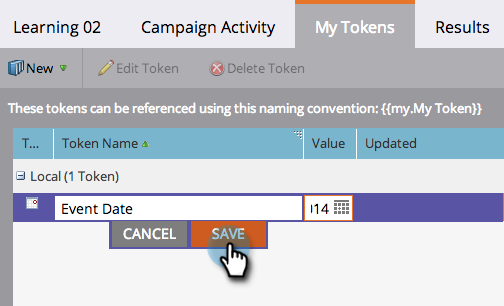
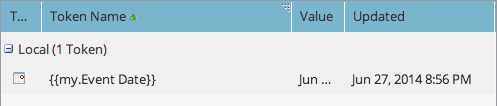
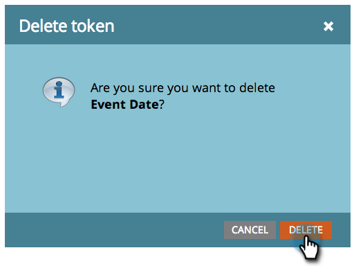

# Administración de tokens {#managing-my-tokens}

El uso de tokens puede simplificar los esfuerzos en Marketo. Puede utilizar [Mis tokens](/help/marketo/product-docs/core-marketo-concepts/programs/tokens/understanding-my-tokens-in-a-program.md) (tokens personalizados) en pasos de flujo, enlaces web, correos electrónicos y páginas de aterrizaje. Así es como hacerlos.

>[!TIP]
>
>Obtenga más información sobre los tokens que ya están disponibles en [Información general de tokens](/help/marketo/product-docs/demand-generation/landing-pages/personalizing-landing-pages/tokens-overview.md).

## Crear un token {#create-a-my-token}

1. Vaya a **Marketing Activities**.

   

1. Seleccione un programa o una carpeta de campaña. Haga clic en **Mis tokens**.

   

1. Seleccione un tipo **My Token**. Arrástrela y suéltela en el lienzo.

   

1. Escriba un nombre único. Introduzca un valor relevante para el token.

   

1. Haga clic en **Guardar**.

   

   ¡Sí! Has hecho un Mi Token.

   

## Editar un token {#edit-a-my-token}

1. Haga doble clic en **My Token** y realice los cambios. Haga clic en **Guardar**.

   

## Eliminar un token {#delete-a-my-token}

>[!CAUTION]
>
>Cuando elimine un token, asegúrese de que no hace referencia a él en ningún recurso. Se mostrará un espacio en blanco en cualquier lugar al que se haga referencia si se elimina.

1. Haga clic con el botón derecho en **My Token**. Seleccione **Eliminar token**.

   

1. Haga clic en **Eliminar**.

   

   >[!MORELIKETHIS]
   >
   >* [Información general sobre tokens](/help/marketo/product-docs/demand-generation/landing-pages/personalizing-landing-pages/tokens-overview.md)
   >* [Explicación de mis tokens en un programa](/help/marketo/product-docs/core-marketo-concepts/programs/tokens/understanding-my-tokens-in-a-program.md)
   >* [Uso de direcciones URL en mis tokens](/help/marketo/product-docs/email-marketing/general/using-tokens/using-urls-in-my-tokens.md)

