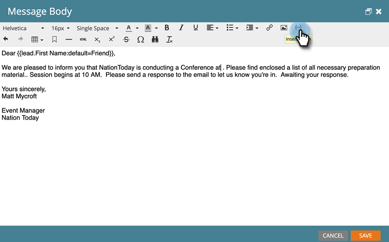

# Tokens de campo personalizados de miembro del programa {#program-member-custom-field-tokens}

## Compatibilidad con tokens para los campos personalizados de miembro del programa {#token-support-for-program-member-custom-fields}

En la parte posterior de las funciones Campos personalizados de miembros del programa , se está ampliando la compatibilidad con Campos personalizados de miembros del programa en los marcos de token.

Los tokens de PMCF serán compatibles con el dominio miembro de la familia de tokens.

Los tokens de miembro se utilizan para los campos comprendidos en el ámbito de los miembros del programa. A partir del estado actual, los tokens de miembro también se utilizan para insertar valores únicos de socios de servicios integrados. `{{member.webinar url}}` resuelve automáticamente la URL de confirmación única de la persona generada por el proveedor de servicios. {{member.registration code}} se resuelve en el código de registro proporcionado por el proveedor de servicios.

>[!NOTE]
>
>* Los campos personalizados de miembro del programa solo se pueden usar en el contexto de un programa.
>* Los tokens de campos personalizados de miembro del programa no se pueden usar en: secuencias de comandos de correo electrónico, encabezado previo de correo electrónico, tokens de fecha en pasos de espera o fragmentos.
>* El estado de miembro del programa no es compatible con los tokens de miembro.

## Uso de tokens de campo personalizados de miembro del programa en Assets {#using-program-member-custom-field-tokens-in-assets}

Puede insertar Tokens de campos personalizados de miembro del programa en correos electrónicos, páginas de aterrizaje, SMS, notificaciones push y Webhooks.

**Correos electrónicos**

1. Seleccione el correo electrónico deseado y haga clic en **Editar borrador**.

   

1. Haga clic en el icono Insertar token .

   

1. Busque y seleccione el Token de campo personalizado del miembro del programa que desee, introduzca un valor predeterminado y haga clic en **Insertar**.

   

1. Haga clic en **Guardar**.

   

>[!NOTE]
>
>No olvide aprobar su correo electrónico.

**Páginas de aterrizaje**

1. Seleccione la página de aterrizaje y haga clic en **Editar borrador**.

   

   >[!NOTE]
   >
   >El diseñador de páginas de aterrizaje se abre en una nueva ventana.

1. Haga doble clic en el cuadro de texto enriquecido al que desee agregar el token.

   

1. Haga clic donde desee que esté el token y, a continuación, haga clic en el icono Insertar token.

   

1. Busque y seleccione el token deseado.

   

1. Introduzca un valor predeterminado y haga clic en **Insert**.

   

1. Haga clic en **Guardar**.

   

**SMS**

1. Seleccione el SMS deseado y haga clic en **Editar borrador**.

   

1. Haga clic en el botón **`{{ Token`**.

   

1. Busque y seleccione el token de campo personalizado del miembro del programa que desee. Introduzca un valor predeterminado y haga clic en Insertar.

   

1. Haga clic en la lista desplegable Acciones de SMS y seleccione **Aprobar y cerrar**.

   

**Notificaciones push**

1. Seleccione la notificación push deseada y haga clic en **Editar borrador**.

   

1. Haga clic en **Notificaciones push**.

   

1. Haga clic en el mensaje en el editor y haga clic en el botón `{{` para obtener el selector de tokens.

   

1. Busque y seleccione el token de campo personalizado del miembro del programa que desee. Introduzca un valor predeterminado y haga clic en **Insert**.

   

1. Haga clic en **Finish** para guardar y salir (o **Next** para revisarlo primero).

   

>[!NOTE]
>
>Si el campo personalizado miembro del programa de un miembro del programa no tiene valor, el token se sustituirá por el valor predeterminado si se ha proporcionado.

## Uso de tokens de campo personalizados de miembro del programa en campañas {#using-program-member-custom-field-tokens-in-campaigns}

Los tokens de campo personalizados de miembro del programa se pueden usar en:

* Crear tarea
* Crear tarea en Microsoft
* Momentos interesantes
* Cambiar acciones de flujo de valor de datos
* Enlaces web
