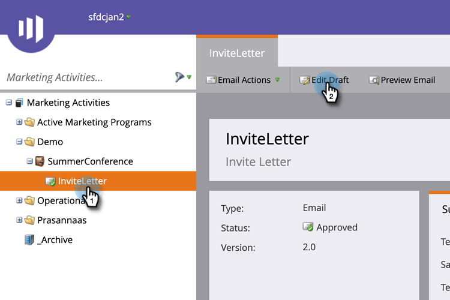

# Tokens de campo personalizado de miembro de programa {#program-member-custom-field-tokens}

## Compatibilidad de tokens para campos personalizados de miembros del programa {#token-support-for-program-member-custom-fields}

En la parte posterior de las funciones Campos personalizados de miembro de programa, se está ampliando la compatibilidad con los Campos personalizados de miembro de programa en los marcos de tokens.

Los tokens de PMCF serán compatibles con el dominio miembro de la familia de tokens.

Los tokens de miembro se utilizan para campos dentro del ámbito de Miembro de programa. A partir del estado actual, los tokens de miembro también se utilizan para insertar valores únicos de socios de servicios integrados. `{{member.webinar url}}` resuelve automáticamente la URL de confirmación única de la persona generada por el proveedor de servicios. {{member.registration code}} resuelve en el código de registro proporcionado por el proveedor de servicios.

>[!NOTE]
>
>* Los campos personalizados de miembros de programa solo se pueden utilizar en el contexto de un programa.
>* Los tokens de campos personalizados de miembros de programa no se pueden usar en: encabezado previo de correo electrónico, tokens de fecha en pasos de espera o fragmentos de código.
>* El estado de miembro del programa no es compatible con los tokens de miembro.

## Uso de tokens de campo personalizado de miembro de programa en Assets {#using-program-member-custom-field-tokens-in-assets}

Puede insertar tokens de campos personalizados de miembros del programa en correos electrónicos, páginas de aterrizaje, SMS, notificaciones push y webhooks.

**Emails**

1. Seleccione el correo electrónico deseado y haga clic en **[!UICONTROL Editar borrador]**.

   

1. Haga clic en el icono Insertar token.

   

1. Busque y seleccione el token de campo personalizado de miembro de programa deseado, introduzca un valor predeterminado y haga clic en **[!UICONTROL Insertar]**.

   

1. Haga clic en **[!UICONTROL Guardar]**.

   

>[!NOTE]
>
>No olvide aprobar su correo electrónico.

**Páginas de destino**

1. Seleccione la página de aterrizaje y haga clic en **[!UICONTROL Editar borrador]**.

   

   >[!NOTE]
   >
   >El diseñador de la página de aterrizaje se abre en una nueva ventana.

1. Haga doble clic en el cuadro de texto enriquecido al que desee agregar el token.

   

1. Haga clic en el lugar donde desee que esté el token y, a continuación, haga clic en el icono Insertar token.

   

1. Busque y seleccione el token deseado.

   

1. Introduzca un valor predeterminado y haga clic en **[!UICONTROL Insertar]**.

   

1. Haga clic en **[!UICONTROL Guardar]**.

   

**SMS**

1. Seleccione el SMS deseado y haga clic en **[!UICONTROL Editar borrador]**.

   

1. Haga clic en **`{{ Token`** botón.

   

1. Busque y seleccione el token de campo personalizado del miembro del programa que desee. Introduzca un valor predeterminado y haga clic en Insert.

   

1. Haga clic en el menú desplegable Acciones de SMS y seleccione **[!UICONTROL Aprobar y cerrar]**.

   

**Insertar notificaciones**

1. Seleccione la notificación push que desee y haga clic en **[!UICONTROL Editar borrador]**.

   

1. Clic **[!UICONTROL Notificación push]**.

   

1. Haga clic en el mensaje en el editor y haga clic en `{{` para obtener el selector de token.

   

1. Busque y seleccione el token de campo personalizado del miembro del programa que desee. Introduzca un valor predeterminado y haga clic en **[!UICONTROL Insertar]**.

   

1. Clic **[!UICONTROL Finalizar]** para guardar y salir (o **[!UICONTROL Siguiente]** para revisarlo primero).

   

>[!NOTE]
>
>Si el campo personalizado del miembro del programa para un miembro del programa no tiene valor, el token se sustituirá por el valor predeterminado si se ha proporcionado.

## Uso de tokens de campo personalizado de miembro de programa en campañas {#using-program-member-custom-field-tokens-in-campaigns}

Los tokens de campo personalizado de miembro de programa se pueden utilizar en:

* Crear tarea
* Crear tarea en Microsoft
* Momentos interesantes
* Cambiar acciones de flujo de valor de datos
* Webhooks
