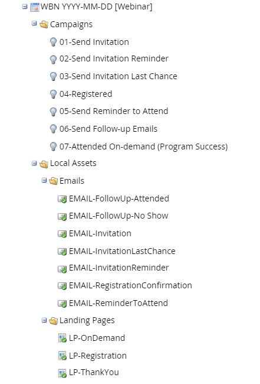

# Práctica recomendada: Organizar los programas {#best-practice-how-to-organize-your-programs}

Existen varias formas de organizar el árbol en Actividades de marketing, así como el contenido de un solo programa. Sin embargo, algunas maneras son mejores y ayudarán a las personas en su departamento de marketing.

>[!TIP]
>
>Un día, (¡cuando te ascenden!) alguien más tratará de darle sentido a sus programas. Una buena organización los ayudará a ser productivos rápidamente.

## Carpetas {#folders}

En Marketing Activities, debe utilizar carpetas para organizar los programas. La estructura que recomendamos se encuentra en el siguiente ejemplo:

>[!NOTE]
>
>**Ejemplo**
>
>* Programas de marketing activos
   >   * Correos electrónicos
   >   * Eventos
      >      * Eventos en directo/programas
      >      * Presentaciones comerciales
      >      * Seminarios web
   >   * Newsletters
   >   * Nurtura
   >   * Contenido web
   >   * Formularios web
>* Aprendizaje
>* Operativo
   >   * Ciclo de vida
   >   * Puntuación
   >   * Gestión de datos
>* Perspectiva de ventas
   >   * Momentos interesantes
   >   * Correos electrónicos de ventas
   >   * Campañas solicitadas de ventas
>* **Archivo**
   >   * Archivar eventos
      >      * Archivo 2012
      >      * Archivo 2013

Cada uno de los mencionados en el ejemplo es una carpeta. Observe cómo todos tienen un nombre único. Puede tener nombres duplicados (más sencillos) de carpetas DENTRO de programas, pero no en la raíz del árbol.

>[!TIP]
>
>La carpeta &quot;Archivar&quot; es un tipo especial de carpeta diseñada para eliminar elementos de listas seleccionadas, así como para crear informes. Esto ayudará a que el sistema se ejecute más rápido. Obtenga [más información sobre las carpetas](/help/marketo/product-docs/core-marketo-concepts/miscellaneous/understanding-folders.md).

Sin duda, puede agregar más carpetas como considere oportuno. Tenga en cuenta que las futuras generaciones de especialistas en marketing de su empresa vivirán con sus decisiones sobre cómo nombrar u organizar las cosas.

## Esquemas de nombres {#naming-schemes}

La asignación de nombres es fundamental, ya que todas las funciones de Marketo utilizan un lenguaje común para comunicarse. Para los programas, debe asignarles un nombre único. **Dos programas no pueden tener el mismo nombre**. Una práctica recomendada es utilizar el siguiente formato:

[Abreviación del ] [tipo de programa AAAA]-[MM]-[opcional ] [DDBrief Descripción]

>[!NOTE]
>
>**Ejemplo**
>
>Ejemplos de nombres de programas:
>
>1. ES 2015-09-21 Introducción de utilidades
>1. Boletín NL 2015-06
>1. Tema del seminario web WBN 2015-12-01 aquí

Los nombres de programa deben ser únicos en su suscripción, incluso en diferentes [espacios de trabajo](/help/marketo/product-docs/administration/workspaces-and-person-partitions/understanding-workspaces-and-person-partitions.md).  Para los recursos locales dentro de los programas, la regla es **mantener el nombre simple**. Solamente nombren una invitación como &quot;Invitación&quot;, en oposición a &quot;Invitación al Seminario Web de junio de 2015&quot;. Dado que se encuentran en un programa, el programa principal forma parte automáticamente del nombre al seleccionarlo en otro lugar. En otras palabras, los recursos locales solo tienen que ser únicos dentro del programa. Puedes tener cientos de activos llamados &quot;Invite&quot;, cada uno en un programa diferente y no te estropeará.

## Tokens {#tokens}

Los tokens utilizan carpetas y programas como vehículo para configurar variables que utilizarán las páginas de aterrizaje, los correos electrónicos y otros recursos.

La organización mencionada anteriormente le permite colocar tokens en la carpeta Event para que se asocie a todos los eventos.

>[!NOTE]
>
>**Ejemplo**
>
>**Su dirección** corporativa. Utilice un token en lugar de escribirlo cada vez. De esta manera puede actualizarlo en un solo lugar sin necesidad de crear muchos borradores. A continuación, anule el token según sea necesario en una carpeta de nivel inferior.

## Eventos {#events}

Un evento suele tener muchas partes en movimiento, entre ellas: invitaciones, páginas de aterrizaje, formularios, utilidades sociales y campañas inteligentes. La práctica recomendada para organizarlos para que sea más fácil utilizarlos es mediante la fase del evento. Este es un ejemplo de cómo debe aparecer el árbol de carpetas para un evento.

## Programas de participación {#engagement-programs}

Obtenga más información [sobre los programas de participación](/help/marketo/product-docs/email-marketing/drip-nurturing/creating-an-engagement-program/understanding-engagement-programs.md). La mejor manera de organizar su programa de participación es con carpetas. Cree una carpeta para cada flujo y, a continuación, coloque los correos electrónicos o programas en esa carpeta. Incluya una carpeta de archivo en cada flujo cuando el contenido quede obsoleto y desee eliminarlo.

## Programas operativos {#operational-programs}

Se utilizan con fines de limpieza de datos. Tener carpetas para las fechas en que se ejecutaron los programas y luego archivar las carpetas. Al hacer que el programa funcione, lo está omitiendo de los informes, lo que es bueno para este tipo de actividad.

## Anidado de programas de correo electrónico {#nesting-email-programs}

Los programas de correo electrónico están diseñados para ser su herramienta para la limpieza del correo. Puede incluirlos en Eventos u otros programas para promociones, invitaciones y recordatorios. Incluyen un panel de control excelente y otras funciones de prueba A/B. Además, se pueden manipular fácilmente en la vista de programación del programa.

También puede crear un programa de correo electrónico como programa independiente. Los programas de correo electrónico no están permitidos dentro de otros programas de correo electrónico. ¡Eso sería una locura!

## Clonación {#cloning}

Una de las funciones más interesantes de Marketo es la capacidad de clonar programas. Esto significa que puede configurar una &quot;plantilla&quot; de programa que tenga todas las campañas inteligentes y los correos electrónicos que desee. Configúrelo por adelantado y luego clónelo para su próxima iniciativa de marketing.

>[!TIP]
>
>Observe las plantillas de evento en el ejemplo de la parte superior. Ponga sus diferentes tipos de eventos ahí para una clonación fácil.

Algunas personas incluso abstraen la mayoría del texto de los correos electrónicos y páginas de aterrizaje en tokens. Esto le permite clonar y luego editar los tokens. Finalmente, vaya a la vista de programación del programa y ajuste las fechas y habrá terminado. ¡Voila!

## Resumen {#summary}

Como pueden ver, hay mucha energía en Marketo. Aquí hemos cubierto los conceptos básicos, pero considere algunos [servicios adicionales de expertos de Marketo](https://www.marketo.com/services/) para ajustar y configurar su éxito.
