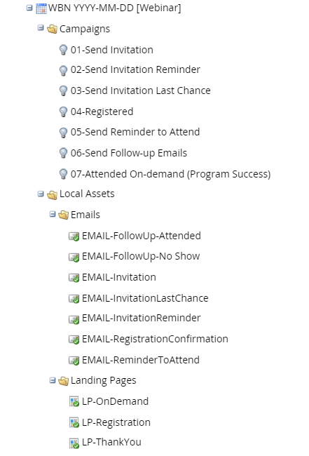

# Práctica recomendada: Cómo organizar los programas {#best-practice-how-to-organize-your-programs}

Existen muchas formas de organizar el árbol en Actividades de marketing, así como el contenido de un solo programa. Sin embargo, algunas formas son mejores y ayudarán a las personas de su departamento de marketing.

>[!TIP]
>
>Un día, alguien más puede necesitar darle sentido a tus programas. Una buena organización les ayudará a ser productivos rápidamente.

## Carpetas {#folders}

En las actividades de marketing, debe utilizar carpetas para organizar los programas. La estructura que recomendamos se muestra en el siguiente ejemplo:

>[!NOTE]
>
>**Ejemplo**
>
>* Programas de marketing activos
>   * Correos electrónicos
>   * Eventos
>     * Eventos en directo / Jornadas
>     * Ferias
>     * Seminarios web
>   * Boletines informativos
>   * Acompañamiento
>   * Contenido web
>   * Formularios web
>* Aprendizaje
>* Operativo
>   * Ciclo de vida
>   * Calificación
>   * Administración de datos
>* Sales Insight
>   * Momentos interesantes
>   * Emails de ventas
>   * Campañas solicitadas de ventas
>* **Archivar**
>   * Archivar eventos
>     * Archivo 2012
>     * Archivo 2013

Cada uno de estos elementos mencionados en el ejemplo es una carpeta. Observe cómo todos tienen un nombre único. Puede tener nombres duplicados (más sencillos) de carpetas DENTRO de los programas, pero no en la raíz del árbol.

>[!TIP]
>
>La carpeta &quot;Archivar&quot; es un tipo especial de carpeta diseñada para eliminar elementos de listas seleccionadas, así como para crear informes. Esto ayudará a que su sistema funcione más rápido. Más información [sobre las carpetas](/help/marketo/product-docs/core-marketo-concepts/miscellaneous/understanding-folders.md){target="_blank"}.

Sin duda, puede agregar más carpetas como crea conveniente. Solo tenga en cuenta que las futuras generaciones de especialistas en marketing de su compañía vivirán con sus decisiones sobre cómo nombrar/organizar las cosas.

## Esquemas de nomenclatura {#naming-schemes}

La asignación de nombres es fundamental, ya que todas las funciones de Marketo utilizan un lenguaje común para comunicarse. Para los programas, debe ponerles un nombre único. **Dos programas no pueden tener el mismo nombre**. Una práctica recomendada es utilizar el siguiente formato:

[Abreviatura del tipo de programa] [AAAA]-[MM]-[DD opcional] [Descripción breve]

>[!NOTE]
>
>**Ejemplo**
>
>Ejemplo de nombres de programas:
>
>1. ES 2015-09-21 Introducción al widget
>1. Boletín NL 2015-06
>1. Tema del seminario web de WBN 2015-12-01 aquí

Los nombres de los programas deben ser únicos en su suscripción, incluso en [espacios de trabajo](/help/marketo/product-docs/administration/workspaces-and-person-partitions/understanding-workspaces-and-person-partitions.md){target="_blank"} diferentes.  Para los recursos locales dentro de los programas, la regla es **mantener el nombre simple**. Asigne un nombre a la invitación &quot;Invitación&quot;, en lugar de &quot;Invitación al seminario web de junio de 2015&quot;. Como se encuentran en un programa, el programa principal forma parte automáticamente del nombre al elegirlo en otra parte. En otras palabras, los recursos locales solo deben ser únicos dentro del programa. Puede tener cientos de recursos llamados &quot;Invitar&quot;, cada uno en un programa diferente y no le causará problemas.

## Tókenes {#tokens}

Los tokens utilizan carpetas y programas como vehículo para establecer variables que se utilizarán en páginas de aterrizaje, correos electrónicos y otros recursos.

La organización mencionada anteriormente le permite colocar tokens en la carpeta Evento para que se propague en cascada a todos los eventos.

>[!NOTE]
>
>**Ejemplo**
>
>**Su dirección corporativa**. Utilice un token en lugar de escribirlo cada vez. De este modo, puede actualizarlo en un solo lugar sin necesidad de crear muchos borradores. A continuación, anule el token según sea necesario en una carpeta de nivel inferior.

## Eventos {#events}

Un evento suele tener muchas partes móviles, incluidas: invitaciones, páginas de aterrizaje, formularios, widgets sociales y campañas inteligentes. La práctica recomendada para organizarlos para facilitar su uso es la fase del Evento. A continuación se muestra un ejemplo del aspecto que debería tener el árbol de carpetas para un Evento.

## Programas de participación {#engagement-programs}

[todo acerca de los programas de participación](/help/marketo/product-docs/email-marketing/drip-nurturing/creating-an-engagement-program/understanding-engagement-programs.md){target="_blank"}. La mejor manera de organizar el programa de participación es con carpetas. Cree una carpeta para cada flujo y luego coloque los correos electrónicos o programas en esa carpeta. Incluya una carpeta de archivos en cada flujo cuando el contenido quede obsoleto y desee eliminarlo.

## Programas operativos {#operational-programs}

Se utilizan con fines de limpieza de datos. Tenga carpetas para las fechas en que se ejecutaron los programas y luego archive las carpetas. Al hacer que el programa sea operativo, lo está omitiendo de la creación de informes, lo que es bueno para este tipo de actividad.

## Anidado de programas de correo electrónico {#nesting-email-programs}

Los programas de correo electrónico están diseñados para ser su herramienta para la limpieza de correos electrónicos. Puede ponerlos dentro de Eventos u otros programas para promociones, invitaciones y recordatorios. Incluyen un tablero de mandos y otras funciones de prueba A/B. También se pueden administrar en la vista de programación del programa.

También puede crear un programa de correo electrónico como programa independiente. Los programas de correo electrónico no están permitidos dentro de otros programas de correo electrónico.

## Clonando {#cloning}

Una de las funciones más útiles de Marketo es la capacidad de clonar programas. Esto significa que puede configurar una &quot;plantilla&quot; de programa que tenga todas las campañas inteligentes y los correos electrónicos que desee. Configúrelo con antelación y clónelo para su próxima iniciativa de marketing.

>[!TIP]
>
>Observe las plantillas de evento en el ejemplo de la parte superior. Coloca tus diferentes tipos de eventos ahí para facilitar la clonación.

Algunas personas incluso abstraen la mayoría del texto de los correos electrónicos y las páginas de aterrizaje en tokens. Esto le permite clonar y luego editar los tokens. Por último, vaya a la vista de programación del programa, ajuste las fechas y verá que ha finalizado.

## Resumen {#summary}

Como puede ver, hay mucho poder en Marketo. Aquí se explican los conceptos básicos, pero considere la posibilidad de recibir servicios adicionales de [expertos en Marketo Engage](https://business.adobe.com/products/marketo/services-support.html){target="_blank"} para ajustarlos y prepararse para el éxito.
