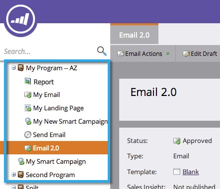

# Clonar un recurso en un programa {#clone-an-asset-in-a-program}

Clonando un programa clona _todo_. A veces, solo desea clonar un recurso. Así es cómo se hace.

>[!NOTE]
>
>Tendrá que realizar pasos adicionales para [clonar un grupo de prueba de página de aterrizaje](/help/marketo/product-docs/demand-generation/landing-pages/landing-page-actions/cloning-a-landing-page-test-group.md){target="_blank"}.

## Clonar un recurso local {#clone-a-local-asset}

1. Vaya a **[!UICONTROL Actividades de marketing]**.

   

1. Seleccione el programa.

   

1. Haga clic con el botón derecho en el recurso local que desee clonar. Haga clic en **[!UICONTROL Clonar]**.

   

1. Cada tipo de recurso presenta un cuadro de diálogo diferente. Simplemente rellene la información y haga clic en **[!UICONTROL Clonar]**.

   

   >[!TIP]
   >
   >También puede clonar un recurso en un programa diferente. Utilice la lista desplegable **[!UICONTROL Programa]** para realizar su selección.

1. El nuevo recurso clonado ahora debe ser visible.

   

   >[!NOTE]
   >
   >[Clonar un programa](/help/marketo/product-docs/core-marketo-concepts/programs/working-with-programs/clone-a-program.md){target="_blank"}
