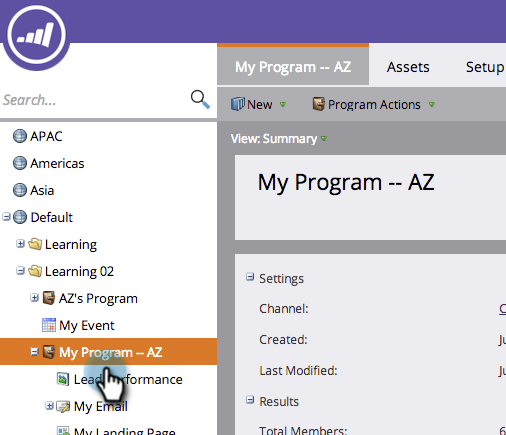

# Clonar un recurso en un Programa {#clone-an-asset-in-a-program}

Clonar un programa clona _todo_. A veces solo desea clonar un recurso. Así es como.

>[!NOTE]
>
>Deberá realizar pasos adicionales para [clonar un grupo de prueba de página de aterrizaje](/help/marketo/product-docs/demand-generation/landing-pages/landing-page-actions/cloning-a-landing-page-test-group.md).

## Clonar un recurso local {#clone-a-local-asset}

1. Vaya a **Marketing** **Actividades**.

   

1. Seleccione su programa.

   

1. Haga clic con el botón secundario en el recurso local que desee clonar. Haga clic en **Clonar**.

   

1. Cada tipo de recurso presenta un cuadro de diálogo diferente. Simplemente complete la información y haga clic en **Clonar**.

   

   >[!TIP]
   >
   >También puede clonar un recurso en otro programa. Utilice la lista desplegable **Programa** para realizar la selección.

1. ¡bueno! Ahora debería ver el nuevo recurso clonado.

   

   >[!NOTE]
   >
   >[Clonar un Programa](/help/marketo/product-docs/core-marketo-concepts/programs/working-with-programs/clone-a-program.md)
