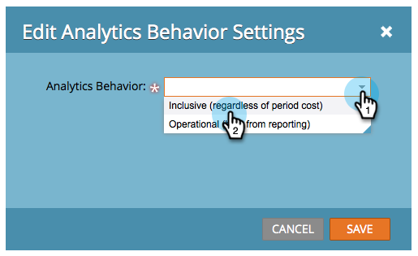

# Editar configuración de comportamiento de Analytics {#edit-analytics-behavior-settings}

Puede establecer el comportamiento [de análisis en el nivel de administrador en canales](/help/marketo/product-docs/reporting/revenue-cycle-analytics/program-analytics/make-a-program-without-a-period-cost-available-in-revenue-explorer-and-analyzers.md), pero también puede editarlo en el nivel de programa. Así es como.

1. Vaya a **Actividades de marketing**.

   

1. Busque y seleccione su programa.

   

1. En la ficha Ajustes, arrastre Comportamiento de Analytics al lienzo.

   

1. Seleccione el comportamiento de Analytics que desee.

   

>[!NOTE]
>
>**Definición**
>
>**Inclusivo** : Esta opción garantiza que el programa esté disponible para sistemas de informes en exploradores y analizadores de ingresos, independientemente de si ha incluido o no un costo de período.
>
>**Operativo** : Esta opción hace que el programa no se muestre ni en el explorador de ingresos ni en los analizadores.

>[!NOTE]
>
>El comportamiento predeterminado (si no se aplica esta configuración) es que el programa se incluiría en Analytics SOLAMENTE si hay al menos un costo de período, incluso uno con cero dólares asignados.

1. Haga clic en **Guardar**.

   

¡Bien hecho! Ahora sabe cómo anular el comportamiento de análisis en el nivel de programa.

>[!NOTE]
>
>Los cambios tendrán efecto al día siguiente y el programa estará disponible o se extraerá de los exploradores y analizadores de ingresos.
