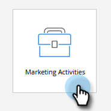
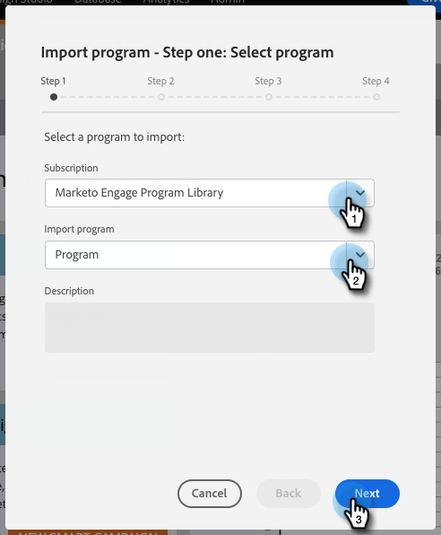
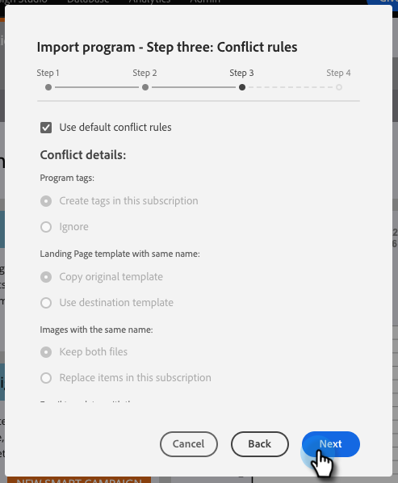

# Importar un programa {#import-a-program}

Un programa se puede importar de una suscripción a otra de Marketo. Por ejemplo, puede crear un programa en un simulador para pruebas y luego importarlo a su suscripción activa. Además, puede importar un programa creado previamente desde la biblioteca de programas de Marketo.

## Importación de un programa {#importing-a-program}

1. Vaya a **Actividades de marketing.**

   

1. Haga clic en **Nuevo** desplegable . Select **Importar programa**.

   

   >[!NOTE]
   >
   >Importación de programa solo está disponible para usuarios que tienen roles con permiso de importación de programa habilitado. Más información sobre [administración de funciones y permisos de usuario](/help/marketo/product-docs/administration/users-and-roles/managing-user-roles-and-permissions.md).
   >
   >Para conectar una cuenta de simulación de pruebas a su suscripción activa, póngase en contacto con [Asistencia de Marketo](https://nation.marketo.com/t5/Support/ct-p/Support).

1. Seleccionar un Marketo **Suscripción** y un programa para importar. Haga clic en **Siguiente**.

   

1. Especifique un **Carpeta de campaña** para el programa importado. Haga clic en **Siguiente.**

   

   >[!NOTE]
   >
   >Asegúrese de **Usar conflicto predeterminado** está seleccionada. Las reglas de conflicto son necesarias cuando se importan programas en una instancia que tiene recursos del mismo nombre.

1. Elija los detalles del conflicto que desee y haga clic en **Siguiente**.

   

   >[!NOTE]
   >
   >Al importar un programa que utilice Pasos de flujo personalizados o reglas de lista inteligente derivadas de un servicio de paso de flujo en una instancia de destino donde haya más de un proveedor de servicios compatible, se pedirá al usuario importador que asigne pasos o reglas al proveedor de servicios correcto en la instancia de destino.

1. Vista previa de detalles y **Importar** el programa.

   

Recibirá una confirmación por correo electrónico una vez que la importación haya finalizado.

>[!NOTE]
>
>Deberá volver a programar campañas por lotes importadas y activar campañas de déclencheur. El sistema desactiva automáticamente las programaciones de campañas y las campañas de déclencheur en el programa importado.

## Identificar programas pregenerados en la biblioteca de programas de Marketo {#identify-pre-built-programs-in-the-marketo-program-library}

La biblioteca de programas de Marketo contiene programas creados previamente y probados que puede importar en su suscripción. Los programas disponibles incluyen:

1. **Nurtura básica del taladro.** Envía una serie de correos electrónicos separados por pasos de espera.
1. **Gestión de datos.** Mantiene la integridad de los datos mediante campañas inteligentes.
1. **Enviar correo electrónico con la página de aterrizaje.** Envía un correo electrónico inicial con una oferta, como &quot;descargar este libro blanco&quot;. Sigue con un correo electrónico de confirmación o recordatorio. Incluye una página de aterrizaje con un formulario.
1. **Correo electrónico con estados de progresión.** Envía una explosión de correo con un enlace rastreable para que la persona haga clic. Actualiza el estado de progresión de cada persona: Enviado, Abierto, Clic, etc.
1. **Momentos interesantes.** Crea momentos interesantes para que su equipo de ventas los mantenga en el circuito.
1. **Página de aterrizaje con respuesta automática.** Utilice contenido descargable para obtener nuevas personas y nutrirlas. Incluye páginas de aterrizaje y formularios.
1. **Ciclo de vida 2.** Utiliza la puntuación para mover una persona de nuevo a cualificado para el marketing.
1. **Plantilla de correo electrónico móvil.** Una plantilla de correo electrónico adaptable probada con iPhone y Android. Algunas versiones de Android, MS Outlook, Exchange y aplicaciones de terceros como Gmail y Yahoo! Las aplicaciones móviles de correo no admiten el CSS necesario para las plantillas adaptables. Se recomienda probar antes de enviar correos electrónicos.
1. **Apuestas para la importación de programas.** Programa Apuestas para aquellos que están probando la Biblioteca de Programas! Simplemente apruebe los correos electrónicos y la página de aterrizaje y active la campaña inteligente. A continuación, vea la página de aterrizaje aprobada, rellene el formulario y ¡se ha introducido!
1. **Campañas Disponibles de Ventas.** Ofrece a sus representantes de ventas una forma de ejecutar campañas inteligentes de Marketo desde un panel en su CRM.
1. **Puntuación - Spark Edition.** Puntuación demográfica y de comportamiento capturada en un único campo de puntuación. Incluye más de dos docenas de campañas relacionadas con la puntuación.
1. **Puntuación: ediciones estándar y determinadas.** Puntuación demográfica y de comportamiento capturada en campos de puntuación independientes. Incluye más de dos docenas de campañas relacionadas con la puntuación.
1. **Sincronizar nuevas personas con CRM.** La campaña que sincroniza nuevas personas con su sistema CRM. Asigna un estado de persona de tal modo que se reconoce que no está listo para las ventas.
1. **Seminario web con adaptador de eventos.** Un conjunto completo de correos electrónicos, como invitaciones y recordatorios, además de páginas de aterrizaje con formularios y campañas para trasladar personas a través del programa. Este programa obtiene actualizaciones sobre registro, asistencia, etc. de proveedores de eventos en línea como WebEx.
1. **Seminario web sin adaptador de evento.** Igual que antes, pero con procesos manuales para registrar el registro, la asistencia, etc.
1. **Programa de Puntuación de Sirius decisions**. Este programa está diseñado para apoyar el Modelo de Puntuación de Sirius decisions estándar, incluyendo las reglas de puntuación implícitas y explícitas y la asignación de persona matrixed.

>[!CAUTION]
>
>Debe crear dos campos personalizados (&quot;Puntuación demográfica&quot; y &quot;Puntuación de comportamiento&quot;) antes de importar el programa Puntuación: ediciones estándar y de selección .

## Impacto en los activos externos durante las importaciones de programas {#impact-on-external-assets-during-program-imports}

Los programas utilizan recursos externos como plantillas de correo electrónico, plantillas de página de aterrizaje, imágenes, formularios, tokens y etiquetas de programa. Tiene la capacidad de configurar cómo se gestionan las plantillas de página de aterrizaje y las etiquetas de programa, y Marketo administra automáticamente el resto.

**Plantillas de página de correo electrónico/aterrizaje:** Las plantillas Correo electrónico/Página de aterrizaje se importan en Design Studio. Puede utilizar reglas de conflicto para configurar el comportamiento cuando exista una plantilla con el mismo nombre. Con la regla predeterminada, se anexará un número a una plantilla si existe uno con el mismo nombre. Por ejemplo, si ya tiene una plantilla denominada &quot;Plantilla estándar&quot;, la nueva se llamará &quot;Plantilla estándar - 1&quot;.

**Páginas de aterrizaje/Forms:** Si existe un formulario o una página de aterrizaje con el mismo nombre en Design Studio, se importarán, pero con un número añadido al nombre (por ejemplo: Página de aterrizaje - 1).

**Imágenes:** Las imágenes utilizadas por las páginas de aterrizaje se importan en el estudio de diseño, a menos que exista una que tenga el mismo nombre.

**Tokens:** Los tokens que residen fuera de un programa se convertirán en tokens locales durante el proceso de importación.

>[!CAUTION]
>
>El tipo de imagen de mis tokens no es compatible con las importaciones de programas. Si se importa un programa que tiene un tipo de imagen, mis tokens, **no** tokens llegarán.

**Etiquetas del programa:** Puede utilizar reglas de conflicto para controlar cómo se tratarán las etiquetas de programa que no existen en la cuenta de destino. Si utiliza la regla predeterminada, se crearán las etiquetas de programa o puede ignorar las etiquetas.

>[!CAUTION]
>
>Al importar un programa, correos electrónicos/páginas de aterrizaje que contienen [contenido dinámico](/help/marketo/product-docs/personalization/segmentation-and-snippets/segmentation/understanding-dynamic-content.md) se omitirá.
