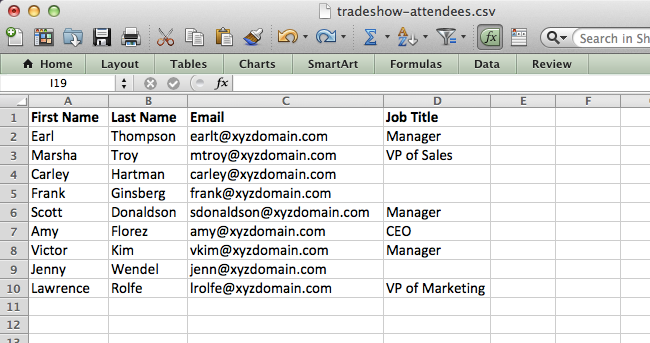

# Importación de miembros de una hoja de cálculo en un Programa {#import-members-from-a-spreadsheet-into-a-program}

Puede importar una lista de personas que se convierten automáticamente en miembros de un programa. Esto es lo que hay que hacer.

## Preparación del archivo CSV {#prepare-your-csv-file}

1. Cree un archivo CSV estándar en Excel, como en el ejemplo siguiente.

   

   >[!CAUTION]
   >
   >Cuando importe una fecha en un campo de fecha, utilice este formato: 23/9/13 (Mes/Día/Año).

## Importar su CSV en Marketing {#import-your-csv-into-marketo}

1. En su programa, vaya a la sección **Miembros** .

   

1. Haga clic en **Importar miembros**.

   

1. Seleccione el CSV y haga clic en **Siguiente**.

   

1. Asigne los valores de datos de la lista a los campos de marketing correspondientes y haga clic en **Siguiente**.

   

   >[!NOTE]
   >
   >Si hay campos que no desea importar, seleccione **IGNORE** en el menú desplegable Campo de marketing.

1. Seleccione el Estado **de** miembro para su lista.

   

1. Haga clic en **Importar**.

   

1. Espere a que Marketo termine de importar y cierre el cuadro de diálogo de confirmación.

   

   ¡bueno! Debe ver los nuevos miembros que ha importado.

   

>[!NOTE]
>
>**Artículos relacionados**
>
>* [Administrar y Vista de miembros](manage-and-view-members.md)

>

