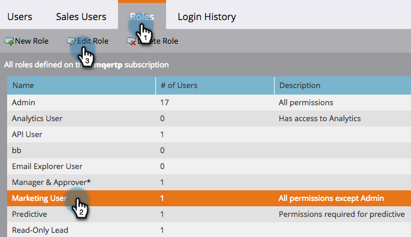

# Caducidad de recurso local {#local-asset-expiration}

Establezca una fecha y hora de caducidad para cancelar la publicación de páginas de aterrizaje, desactivar campañas de déclencheur o detener campañas por lotes recurrentes.

## Conceder permiso de caducidad de recursos programados {#grant-schedule-asset-expiration-permission}

Para poder programar una caducidad de recursos, la función de Marketo debe tener habilitado el permiso adecuado.

>[!NOTE]
>
>**Permisos de administración necesarios**

1. En el [!UICONTROL Administrador] , haga clic en **[!UICONTROL Usuarios y funciones]**.

   

1. Haga clic en **[!UICONTROL Funciones]** , seleccione el usuario al que desea conceder acceso y, a continuación, haga clic en **[!UICONTROL Editar rol]**.

   

1. En [!UICONTROL Acceso a actividades de marketing], seleccione **[!UICONTROL Programar caducidad del recurso local]** y haga clic en **[!UICONTROL Guardar]**.

   

## Establecer una fecha de caducidad {#set-an-expiration-date}

1. Haga clic con el botón derecho en el programa deseado y seleccione **[!UICONTROL Establecer caducidad del recurso local]**.

   

1. Compruebe los recursos para los que desea establecer una fecha de caducidad y haga clic en **[!UICONTROL Definir caducidad]**.

   

1. Elija una fecha de caducidad.

   

1. Fije una hora. Debe programar una hora al menos 15 minutos en el futuro (no olvide introducir AM/PM). Clic **[!UICONTROL Confirmar]** cuando termine.

   

>[!NOTE]
>
>* Para editar una fecha de caducidad existente, simplemente compruebe los recursos y haga clic en **[!UICONTROL Definir caducidad]**.
>* Una vez que un recurso haya caducado, ya no aparecerá en la cuadrícula Caducidad. La cuadrícula solo mostrará páginas de aterrizaje publicadas, campañas de déclencheur activas y campañas por lotes recurrentes.
>* Las caducidades programadas se eliminarán si el recurso se mueve a otro programa.

## Eliminar una fecha de caducidad {#remove-an-expiration-date}

1. Para eliminar una fecha de caducidad, compruebe los recursos y haga clic en **[!UICONTROL Eliminar caducidad]**.

   

1. Revise los recursos afectados y haga clic en **[!UICONTROL Confirmar]**.

   

>[!NOTE]
>
>Las fechas de caducidad inferiores a 15 minutos en el futuro no se pueden eliminar. Para &quot;eliminar&quot; la caducidad, debe esperar a que caduque el recurso y, a continuación, volver a aprobarlo o activarlo.
