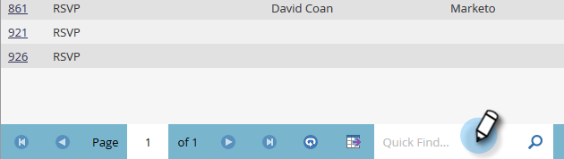

# Administrar y ver miembros {#manage-and-view-members}

Puede administrar y ver a sus miembros en sus programas mediante la pestaña Miembros .

>[!NOTE]
>
>Profundizar en [membresía del programa](/help/marketo/product-docs/core-marketo-concepts/programs/creating-programs/understanding-program-membership.md).

## Buscar un miembro {#search-for-a-member}

En la parte inferior de la sección Miembros, utilice el campo de búsqueda para buscar miembros del programa por nombre, correo electrónico, puesto de trabajo o empresa.

1. Haga clic en la pestaña **Members** del programa.

   

1. Utilice el campo de búsqueda para buscar la lista de miembros.

   

## Exportar la cuadrícula de miembros {#export-the-members-grid}

Para exportar la lista de miembros, haga clic en el icono de Excel situado junto al campo de búsqueda.

## Administrar columnas en la cuadrícula de miembros {#manage-columns-in-the-members-grid}

Arrastre y suelte las columnas para cambiar su orden. El par de flechas azules indica adónde irá la columna.

Haga clic con el botón derecho en el encabezado de la columna para ordenarla alfabéticamente, ya sea ascendente o descendente.

## Elija qué columnas son visibles en la cuadrícula {#choose-which-columns-are-visible-in-the-grid}

1. Haga clic en la lista desplegable **View** y seleccione **Create View**.

   

1. Asigne un nombre a la vista personalizada. Seleccione los títulos de las columnas. Haga clic en **Add** y **Remove** para mover columnas y crear una vista.

   

1. Haga clic en **Crear**.

   

## Filtrar la cuadrícula de miembros {#filter-the-members-grid}

1. Haga clic en la lista desplegable **Filter** y seleccione un paso de progresión por el que ordenar.

   

## Administrar estado de persona en la cuadrícula de miembros {#manage-person-status-in-the-members-grid}

Puede cambiar el estado de las personas dentro de la cuadrícula de miembros.

1. Mantenga presionada la tecla **Ctrl/Cmd** y seleccione las personas.

   

1. Haga clic en la lista desplegable **Change Status** y seleccione un estado.

   

   Esto puede tardar un momento. Verá el siguiente mensaje cuando todo esté terminado.

   

Tantas características, pero todas son bastante sencillas. ¡Disfrútelo!

>[!MORELIKETHIS]
>
>[Crear un informe de rendimiento del programa](/help/marketo/product-docs/core-marketo-concepts/programs/program-performance-report/create-a-program-performance-report.md)
