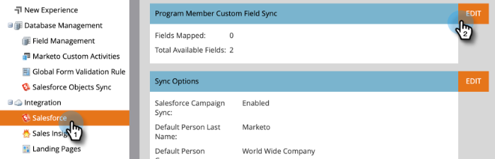

# Sincronización de campos personalizados de miembro del programa {#program-member-custom-field-sync}

>[!PREREQUISITES]
>
>* Creación [Campos personalizados de miembro del programa](/help/marketo/product-docs/core-marketo-concepts/programs/working-with-programs/program-member-custom-fields.md){target=&quot;_blank&quot;}
>* [Sincronización de una campaña de Salesforce con un programa](/help/marketo/product-docs/core-marketo-concepts/programs/working-with-programs/sync-an-sfdc-campaign-with-a-program.md){target=&quot;_blank&quot;}

>[!NOTE]
>
>El objeto Miembro del programa puede tener hasta 20 campos personalizados. Estos campos están disponibles para cualquier programa.

## Asignar campos de Salesforce a campos personalizados de miembros del programa {#map-salesforce-fields-to-program-member-custom-fields}

1. En Marketo, haga clic en **Administrador**.

   

1. Haga clic en **Salesforce** y haga clic en **Editar** junto a Sincronización de campos personalizados de miembro del programa.

   

1. Utilice el cuadro de búsqueda para localizar los campos de Salesforce que desea asignar. En este ejemplo, utilizamos No llamar.

   

1. Haga clic en la lista desplegable .

   

1. Elija el campo personalizado del miembro del programa de Marketo que desee asignar.

   

   >[!NOTE]
   >
   >La lista desplegable solo mostrará Campos personalizados de miembro del programa que coincidan con el tipo de datos del campo Salesforce.

1. Para asignaciones de campo adicionales, borre el cuadro de búsqueda y repita los pasos del 3 al 5.

1. Haga clic en **Guardar** cuando haya terminado.

   

   >[!IMPORTANT]
   >
   >Los cambios en los datos de los miembros del programa en los campos asignados se sincronizarán entre Marketo y Salesforce a partir de ahora.

   >[!NOTE]
   >
   >Si cambia el nombre o el tipo de datos de un campo en Salesforce, se eliminará cualquier asignación de ese campo con el campo personalizado Miembro del programa. Pero puede volver a asignarlo al nuevo campo después de la revisión.

## Desasignar campos de Salesforce de Campos personalizados de miembros del programa {#unmap-salesforce-fields-from-program-member-custom-fields}

Si alguna vez desea liberar un campo para reemplazarlo, o simplemente realizar un cambio general, primero debe realizar una desasignación. Así es como.

1. En Marketo, haga clic en **Administrador**.

   

1. Haga clic en **Salesforce** y haga clic en **Editar** junto a Sincronización de campos personalizados de miembro del programa.

   

1. Utilice el cuadro de búsqueda para localizar los campos que desea desasignar. En este ejemplo, utilizamos No llamar.

   

   >[!TIP]
   >
   >Puede seleccionar el **Asignado** para ver solo los campos asignados.

1. Desasignar haciendo clic en el botón **X** junto al campo .

   

1. La asignación ahora se elimina. Haga clic en **Guardar**.

   

## Asignación de tipos de datos {#data-type-mapping}

<table>
  <colgroup>
    <col/>
    <col/>
  </colgroup>
  <tbody>
    <tr>
      <th>Tipo de datos SFDC</th>
      <th>Tipo de datos de campo personalizado de miembro del programa</th>
    </tr>
    <tr>
      <td>Texto</td>
      <td>Cadena</td>
    </tr>
    <tr>
      <td>Lista de selección</td>
      <td>Cadena</td>
    </tr>
    <tr>
      <td>Lista de selección múltiple</td>
      <td>Cadena</td>
    </tr>
    <tr>
      <td>Teléfono</td>
      <td>Cadena</td>
    </tr>
    <tr>
      <td>Email</td>
      <td>Cadena</td>
    </tr>
    <tr>
      <td>Número(m)</td>
      <td>Entero</td>
    </tr>
    <tr>
      <td>Número(m,n)</td>
      <td>Flotante</td>
    </tr>
    <tr>
      <td>Casilla de verificación</td>
      <td>Booleano</td>
    </tr>
    <tr>
      <td>URL</td>
      <td>URL</td>
    </tr>
    <tr>
      <td>Fecha</td>
      <td>Fecha</td>
    </tr>
    <tr>
      <td>Datetime</td>
      <td>Datetime</td>
    </tr>
    <tr>
      <td>Búsqueda (referencia)</td>
      <td>Cadena</td>
    </tr>
    <tr>
      <td>Base64</td>
      <td>Cadena</td>
    </tr>
  </tbody>
</table>

>[!MORELIKETHIS]
>
>* [Cambiar datos de miembros del programa](/help/marketo/product-docs/core-marketo-concepts/smart-campaigns/program-flow-actions/change-program-member-data.md){target=&quot;_blank&quot;}
>* [Ver datos en la cuadrícula Miembro del programa](/help/marketo/product-docs/core-marketo-concepts/programs/working-with-programs/manage-and-view-members.md){target=&quot;_blank&quot;}
>* [Sincronización SFDC - Sincronización de campaña](/help/marketo/product-docs/crm-sync/salesforce-sync/sfdc-sync-details/sfdc-sync-campaign-sync.md){target=&quot;_blank&quot;}

