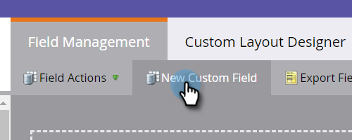
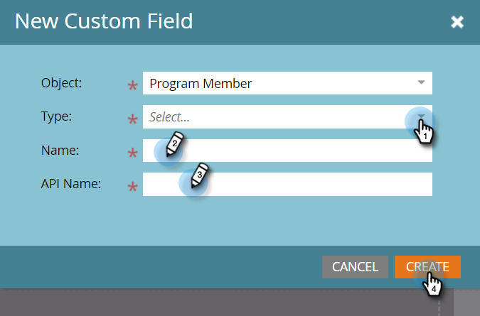

# Campos personalizados del miembro del programa {#program-member-custom-fields}

Los campos personalizados de miembro de programa permiten recopilar datos específicos del programa para cada miembro. Se pueden utilizar en: formularios Marketo Forms, déclencheur y filtros de listas inteligentes y acciones de flujo de campañas inteligentes. Los datos se pueden ver en la pestaña Miembros del programa.

## Crear un campo personalizado de miembro de programa {#create-a-program-member-custom-field}

1. En Marketo, haga clic en **[!UICONTROL Administrador]**.

   

1. Haga clic en **[!UICONTROL Administración de campos]**.

   

1. Haga clic en **[!UICONTROL Nuevo campo personalizado]**.

   

1. Haga clic en el menú desplegable **[!UICONTROL Objeto]** y seleccione el objeto que desee.

   

   >[!NOTE]
   >
   >Los campos personalizados [!UICONTROL Persona] y [!UICONTROL Miembro del programa] no pueden compartir el mismo nombre.

1. Rellene los campos restantes y haga clic en **[!UICONTROL Crear]**.

   

   >[!NOTE]
   >
   >Los tipos compatibles con los campos personalizados [!UICONTROL Miembro de programa] son: booleano, fecha, fecha y hora, flotante, entero, cadena y dirección URL. [Más información sobre los tipos de campo](/help/marketo/product-docs/administration/field-management/custom-field-type-glossary.md){target="_blank"}.

## Descripciones de objetos {#object-descriptions}

| Objeto | Descripción |
|---|---|
| Compañía | El nombre de la compañía asociada con la persona. |
| Oportunidad | Una oportunidad se puede asociar a una persona o cuenta como una venta futura potencial. Normalmente, entran en Marketo a través de un CRM o de una API. |
| Persona | Persona de la base de datos de Marketo con la que participa mediante campañas de marketing. |
| Miembro del programa | Persona que también es miembro de un programa |

## Déclencheur y filtros {#triggers-and-filters}

Puede aprovechar estos datos específicos del programa en listas inteligentes mediante [déclencheur](/help/marketo/product-docs/core-marketo-concepts/smart-campaigns/creating-a-smart-campaign/define-smart-list-for-smart-campaign-trigger.md){target="_blank"} o [filtros](/help/marketo/product-docs/core-marketo-concepts/smart-lists-and-static-lists/creating-a-smart-list/find-and-add-filters-to-a-smart-list.md){target="_blank"}.

## Cosas que debe saber {#things-to-know}

* Los campos personalizados de miembro de programa solo están disponibles en los recursos locales. No son compatibles con Design Studio porque no hay forma de vincularlos a un programa específico.
* No se puede clonar ni mover a Design Studio un formulario (o una página de aterrizaje con un formulario) que contenga campos personalizados de miembro de programa.
* [Puede sincronizar](/help/marketo/product-docs/core-marketo-concepts/programs/working-with-programs/program-member-custom-field-sync.md){target="_blank"} los campos personalizados del miembro del programa con los campos personalizados del miembro de la campaña.
* El objeto Miembro de programa puede tener hasta 20 campos personalizados. Estos campos están disponibles para cualquier programa.
* Cuando se quita un miembro de un programa, si tiene datos en el campo personalizado Miembro del programa, los datos se eliminan de ese campo.
* Para ver los datos, haga clic en la pestaña Miembros del programa y cree una vista personalizada que incluya dichos campos.
* Se admiten la importación y exportación mediante [list](/help/marketo/getting-started/quick-wins/import-a-list-of-people.md){target="_blank"} y [API](https://experienceleague.adobe.com/es/docs/marketo-developer/marketo/home){target="_blank"}. Las exportaciones solo funcionan en listas de miembros de programa, no en listas estáticas.
* Cuando combina dos personas, se utilizan los datos del campo personalizado Miembro del programa del ganador. Pero si el ganador no tiene ninguno, se utilizará el valor del perdedor.
* No se permite cambiar el tipo en los campos Información de miembro del programa.
* La restricción &quot;contiene&quot; de la lista inteligente no es compatible con los campos personalizados de miembro de programa.

>[!MORELIKETHIS]
>
>* [Crear un campo personalizado en Marketo](/help/marketo/product-docs/administration/field-management/create-a-custom-field-in-marketo.md){target="_blank"}
>
>* [Sincronización de campos personalizados de miembros del programa](/help/marketo/product-docs/core-marketo-concepts/programs/working-with-programs/program-member-custom-field-sync.md){target="_blank"}
