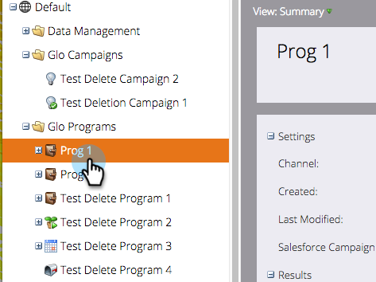
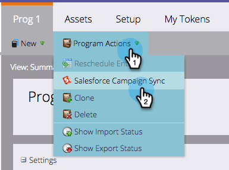
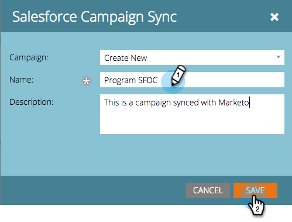

# Sincronización de una campaña de SFDC con un programa {#sync-an-sfdc-campaign-with-a-program}

Marketo Engage le permite sincronizar sus programas con [!DNL Salesforce] campañas para mantener la misma lista de personas en ambos sistemas, incluidos sus estados. ¡Empecemos!

>[!PREREQUISITES]
>
>Primero tendrá que [habilitar [!DNL Salesforce] la sincronización de campaña](/help/marketo/product-docs/crm-sync/salesforce-sync/setup/optional-steps/enable-disable-campaign-sync.md){target="_blank"}.

>[!CAUTION]
>
>Al sincronizar una campaña de SFDC con un programa de Marketo Engage, las acciones de SFDC implícitas (por ejemplo, agregar a SFDC Campaign, Sincronizar con SFDC) se desactivan para las campañas secundarias del programa.

1. Vaya a **[!UICONTROL Actividades de marketing]**.

   

1. Seleccione el programa.

   

1. Haga clic en **[!UICONTROL Acciones del programa]** y, a continuación, seleccione **[!UICONTROL Sincronización de Salesforce Campaign]**.

   

1. Seleccione **[!UICONTROL Crear nuevo]** o elija una campaña [!DNL Salesforce] existente.

   >[!TIP]
   >
   >Si selecciona una campaña [!DNL Salesforce] existente, asegúrese de [coincidir con los estados de programa de la  [!DNL Salesforce] campaña y el programa de Marketo](/help/marketo/product-docs/crm-sync/salesforce-sync/sfdc-sync-details/how-to-match-program-statuses-and-salesforce-campaign-statuses-prior-to-sync.md){target="_blank"}.

1. Escriba un nombre para la nueva campaña y haga clic en **[!UICONTROL Guardar]**.

   

1. Ahora puede verificar los detalles de sincronización de campañas en la página de resumen del programa.

   

   Los cambios de estado del programa en Marketo ahora se sincronizan con la campaña de SFDC y viceversa.
