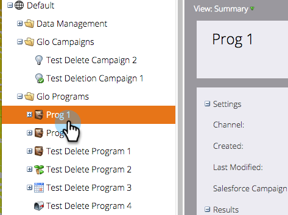

# Sincronización de una campaña de SFDC con un programa {#sync-an-sfdc-campaign-with-a-program}

Marketo le permite sincronizar sus programas con campañas de Salesforce para mantener la misma lista de personas en ambos sistemas, incluidos sus estados. Comencemos!

>[!PREREQUISITES]
>
>Deberá hacer lo siguiente [habilitar sincronización de campaña de Salesforce](/help/marketo/product-docs/crm-sync/salesforce-sync/setup/optional-steps/enable-disable-campaign-sync.md) primero.

>[!CAUTION]
>
>Al sincronizar una campaña de SFDC con un programa de Marketo, las acciones de SFDC implícitas (por ejemplo, agregar a la campaña de SFDC o Sincronizar con SFDC) se desactivarán para las campañas secundarias del programa.

1. Ir a **Actividades de marketing**.

   

1. Seleccione el programa.

   

1. Clic **Acciones de programa**, luego seleccione **Sincronización de campaña de Salesforce**.

   

1. Seleccionar **Crear nuevo** o elija una campaña de Salesforce existente.

   >[!TIP]
   >
   >Si selecciona una campaña de Salesforce existente, asegúrese de lo siguiente [hacer coincidir los estados de programa de la campaña de Salesforce y del programa de Marketo](/help/marketo/product-docs/crm-sync/salesforce-sync/sfdc-sync-details/how-to-match-program-statuses-and-salesforce-campaign-statuses-prior-to-sync.md).

1. Introduzca un nombre para la nueva campaña y haga clic en **Guardar**.

   

1. Ahora puede verificar los detalles de sincronización de campañas en la página de resumen del programa.

   

   ¡Excelente! Ahora, cualquier cambio de estado de programa en Marketo se sincroniza con la campaña de SFDC y viceversa.
