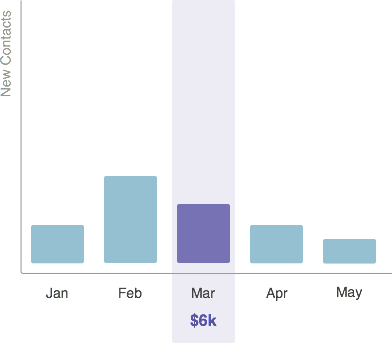
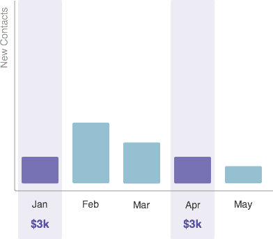

# Explicación de costes del período {#understanding-period-costs}

## Información general {#overview}

Los costos de período se refieren al dinero que gasta en un mes específico en un programa.

>[!NOTE]
>
>**Ejemplo**
>
>Si gasta 1000 $ para contratar a un ilustrador para un(a) [!DNL eBook] que se inicie en julio, el programa [!DNL eBook] tendría un costo de período de 1000 $ en julio.
>
>Si gasta 200 $ al mes en [!DNL Google Adwords], el programa [!DNL Google Adwords] tendría un costo de período de 200 $ _al mes_.

>[!NOTE]
>
>[Explicación de programas](/help/marketo/product-docs/core-marketo-concepts/programs/creating-programs/understanding-programs.md)
>
>[Descripción del abono al programa](/help/marketo/product-docs/core-marketo-concepts/programs/creating-programs/understanding-program-membership.md)

## Cálculo de Costes de Período {#how-period-costs-are-calculated}

Imagine un evento, como un seminario web, que se produce en marzo. Las nuevas personas son adquiridas de antemano de la publicidad en enero y febrero. Nuevos contactos también se adquieren después del evento, cuando la gente descarga el seminario web en los meses de abril y mayo.

1. Con un solo periodo de coste atribuido a marzo...

   

   ...los contactos agregados en los meses anteriores y posteriores _solo_ contarán hacia marzo.

   

1. Con los costes del periodo atribuidos a enero, febrero y marzo...

   

   ...los contactos añadidos solo en los meses posteriores a marzo se contarán hacia marzo.

   

1. Con los costes del periodo atribuidos a enero y abril...

   

   ...los contactos agregados en los meses de enero a marzo se contarán hacia enero. Los contactos agregados en los meses de abril y mayo se contarán hacia abril.

   

   >[!NOTE]
   >
   >En resumen: los meses sin un periodo definido, los costes se desplazarán &quot;hacia atrás&quot; hasta el último que se haya definido. Si no hay ningún coste de periodo anterior, los meses se trasladan &quot;hacia delante&quot; al siguiente que se haya definido. Si no se ha definido un costo de período para _cualquier_ meses, los informes en RCE no estarán disponibles para el programa.

   >[!MORELIKETHIS]
   >
   >* [Uso de costos de período en un programa](/help/marketo/product-docs/core-marketo-concepts/programs/working-with-programs/using-period-costs-in-a-program.md)
   >* [Filtrar un informe de programa por costo de período](/help/marketo/product-docs/core-marketo-concepts/programs/program-performance-report/filter-a-program-report-by-period-cost.md)
