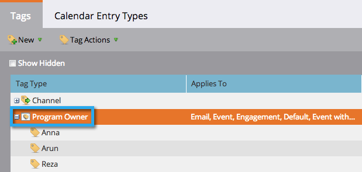

# Información sobre las etiquetas {#understanding-tags}

Probablemente ya sepa que los programas son como componentes básicos en Marketo. El uso de etiquetas y canales le ayudará a filtrar los datos para crear informes.

Las etiquetas se utilizan para describir programas. Puede hacer todo lo que necesite, cada uno con valores únicos. Los canales identifican el mecanismo de entrega de un programa, como un seminario web, un patrocinio o una publicidad en línea.

## Tipo de etiqueta {#tag-type}

Los tipos de etiquetas identifican el tipo de información que desea ordenar.

>[!TIP]
>
>Si desea crear etiquetas personalizadas, póngase en contacto con el [administrador de Marketo](/help/marketo/product-docs/administration/tags/create-custom-tags.md).

>[!NOTE]
>
>**Ejemplo**
>
>* Tipo de etiqueta = Propietario del programa

## Valor de etiqueta {#tag-value}

Cada tipo de etiqueta tendrá valores para elegir.

>[!NOTE]
>
>**Ejemplo**
>
>* Valores de etiqueta = Anna, Arun, Reza

## Canal {#channel}

Los canales se utilizan para informar sobre cómo sus [miembros](/help/marketo/product-docs/core-marketo-concepts/programs/creating-programs/understanding-program-membership.md) se trasladaron a través del programa. Cada canal tiene un conjunto de estados de progresión y un estado que se establece en igual éxito.

>[!NOTE]
>
>**Ejemplo**
>
>* Canal = Programa
>* Estado de progresión = invitado, registrado, asistido, sin programa
>* Correcto = Asistida

>[!MORELIKETHIS]
>
>* [Crear etiquetas personalizadas](/help/marketo/product-docs/administration/tags/create-custom-tags.md)
>* [Creación de un canal de programa](/help/marketo/product-docs/administration/tags/create-a-program-channel.md)

