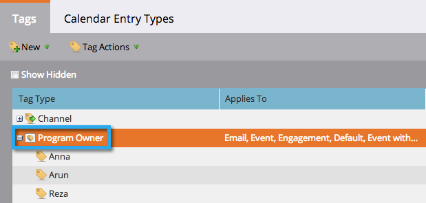

# Explicación de las etiquetas {#understanding-tags}

Probablemente ya sepa que los programas son como componentes básicos en Marketo Engage. El uso de etiquetas y canales le ayudará a filtrar los datos con fines de creación de informes.

Las etiquetas se utilizan para describir programas. Puede crear tantas como necesite, cada una con valores únicos. Los canales identifican el mecanismo de envío de un programa, como un seminario web, un patrocinio o un anuncio en línea.

## Tipo de etiqueta {#tag-type}

Los tipos de etiquetas identifican el tipo de información por la que desea ordenar.

>[!TIP]
>
>Hable con su administrador de Marketo si desea crear [etiquetas personalizadas](/help/marketo/product-docs/administration/tags/create-custom-tags.md){target="_blank"}.

>[!NOTE]
>
>**Ejemplo**
>
>* [!UICONTROL Tipo de etiqueta] = Propietario del programa

## Valor de etiqueta {#tag-value}

Cada tipo de etiqueta tiene valores para elegir.

>[!NOTE]
>
>**Ejemplo**
>
>* Valores de etiqueta = Anna, Arun, Reza

## Canal {#channel}

Los canales se usan para informar sobre cómo se movieron tus [miembros](/help/marketo/product-docs/core-marketo-concepts/programs/creating-programs/understanding-program-membership.md){target="_blank"} a través de tu programa. Cada canal tiene un conjunto de estados de progresión y un estado que se configura para que sea igual de exitoso.

>[!NOTE]
>
>**Ejemplo**
>
>* Channel = Roadshow
>* Estado de progresión = Invitado, Registrado, Asistido, Sin presentación
>* Correcto = Ha asistido

>[!MORELIKETHIS]
>
>* [Crear etiquetas personalizadas](/help/marketo/product-docs/administration/tags/create-custom-tags.md){target="_blank"}
>* [Crear un canal de programa](/help/marketo/product-docs/administration/tags/create-a-program-channel.md){target="_blank"}
