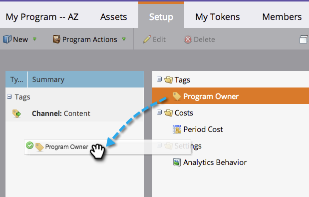
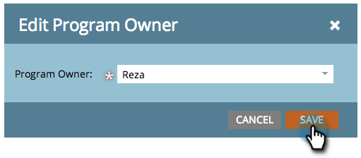

# Uso de etiquetas en un programa {#use-tags-in-a-program}

Las etiquetas son atributos que describen sus programas y se utilizan para agrupar tipos de programas en los informes.

>[!NOTE]
>
>Si utiliza el Explorador del ciclo de ingresos, se debe definir un coste de periodo (incluso si es 0) para que los informes estén disponibles para el programa.

## Uso de una etiqueta en un programa {#use-a-tag-in-a-program}

1. Seleccione el programa. Haga clic en **[!UICONTROL Configuración]**.

   

1. Arrastre y suelte una etiqueta en el lienzo.

   

1. Seleccione un valor de la lista desplegable.

   

1. Haga clic en **[!UICONTROL Guardar]**.

   

1. Muy bien. Verá la nueva etiqueta en el lienzo.

   

## Editar una etiqueta {#edit-a-tag}

1. Vaya a la ficha **[!UICONTROL Configuración]**. Haga clic con el botón derecho en la etiqueta. Seleccione **[!UICONTROL Editar]**.

   

1. Haga clic en la lista desplegable. Seleccione un nuevo valor.

   

1. Haga clic en **[!UICONTROL Guardar]**.

   

1. ¡Excelente! Debería ver las ediciones reflejadas en el lienzo.

   

## Eliminar una etiqueta  {#delete-a-tag}

1. Vaya a la ficha **[!UICONTROL Configuración]**. Haga clic con el botón derecho en la etiqueta y seleccione **[!UICONTROL Eliminar]**.

   

1. Haga clic en **[!UICONTROL Eliminar]** para confirmar.

   

¡Buen trabajo! Los programas con etiquetas coherentes facilitan mucho la ejecución de los informes.
