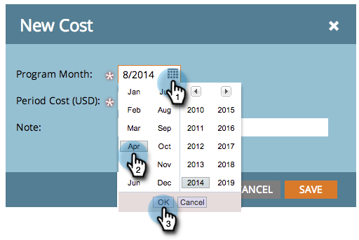

# Uso de Costes de Periodo en un Programa {#using-period-costs-in-a-program}

Un [costo de período](/help/marketo/product-docs/core-marketo-concepts/programs/working-with-programs/understanding-period-costs.md) es la cantidad que gasta en un programa. Puede durar uno o más meses y se utiliza para informar sobre el ROI.

## Agregar un costo de período {#add-a-period-cost}

1. Vaya a la pestaña **Setup** del programa.

   

1. Arrastre y suelte **Period Cost** en el lienzo.

   

1. Haga clic en el icono de calendario. Seleccione un mes. Haga clic en **OK**.

   

1. Introduzca un **Period Cost** (sin decimales ni comas). Haga clic en **Guardar**.

   >[!NOTE]
   >
   >Esto puede ser una estimación. Siempre puede editar un coste de período una vez que sepa la cantidad exacta (consulte la siguiente sección).

   

1. El coste se muestra en el programa.

   

   >[!TIP]
   >
   >Puede arrastrar y soltar varios costes de período en el lienzo. Esto le permite atribuir varios meses con diferentes costes de período al programa.

## Editar un costo de período {#edit-a-period-cost}

1. Si gasta más o menos dinero del previsto originalmente, puede editar el costo del período.

1. Vaya a la pestaña **Setup** del programa.

   

1. Haga clic con el botón derecho en **Period Cost**. Seleccione **Editar**.

   

1. Realice los cambios necesarios. Haga clic en **Guardar**.

   

## Eliminar un costo de período {#delete-a-period-cost}

1. Vaya a la pestaña **Setup** del programa.

   

1. Haga clic con el botón derecho en **Period Cost**. Seleccione **Delete**.

   

1. Haga clic en **Delete** para confirmar.

   

>[!MORELIKETHIS]
>
>* [Explicación de los costes de período](/help/marketo/product-docs/core-marketo-concepts/programs/working-with-programs/understanding-period-costs.md)
>* [Filtrar un informe de programa por costo de período](/help/marketo/product-docs/core-marketo-concepts/programs/program-performance-report/filter-a-program-report-by-period-cost.md)

