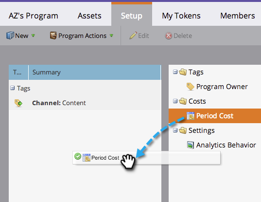
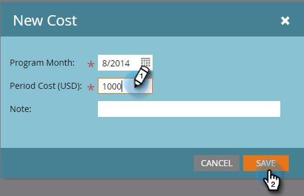
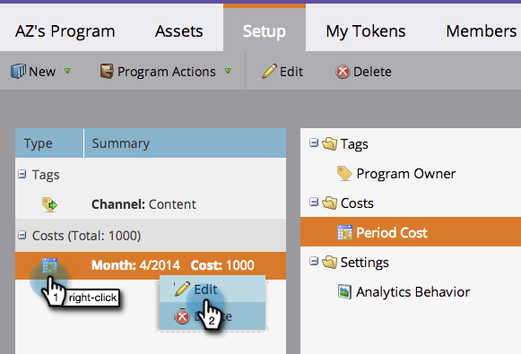
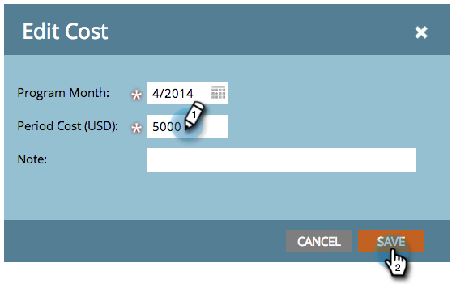

# Uso de costes de período en un programa {#using-period-costs-in-a-program}

Un [costo de período](/help/marketo/product-docs/core-marketo-concepts/programs/working-with-programs/understanding-period-costs.md){target="_blank"} es la cantidad que gasta en un programa. Puede ser para uno o más meses y se utiliza para informar sobre el retorno de la inversión.

## Agregar un costo de período  {#add-a-period-cost}

1. Vaya a la ficha **[!UICONTROL Configuración]** de su programa.

   

1. Arrastre y suelte **[!UICONTROL Costo de período]** en el lienzo.

   

1. Haga clic en el icono de calendario. Seleccione un mes. Haga clic en **[!UICONTROL Aceptar]**.

   

1. Escriba un **[!UICONTROL Costo de período]** (sin decimales ni comas). Haga clic en **[!UICONTROL Guardar]**.

   >[!NOTE]
   >
   >Esto puede ser una estimación. Siempre puede editar un coste de periodo una vez que sepa la cantidad exacta (consulte la siguiente sección).

   

1. El coste se muestra en el programa.

   

   >[!TIP]
   >
   >Puede arrastrar y soltar varios costes de período en el lienzo. Esto permite atribuir varios meses con diferentes costes de periodo al programa.

## Editar un coste de período {#edit-a-period-cost}

1. Si gasta más o menos dinero del previsto originalmente, puede editar el coste del periodo.

1. Vaya a la ficha **[!UICONTROL Configuración]** de su programa.

   

1. Haga clic con el botón derecho en **[!UICONTROL Costo de período]**. Seleccione **[!UICONTROL Editar]**.

   

1. Realice las modificaciones que desee. Haga clic en **[!UICONTROL Guardar]**.

   

## Eliminar un coste de período {#delete-a-period-cost}

1. Vaya a la ficha **[!UICONTROL Configuración]** de su programa.

   

1. Haga clic con el botón derecho en **[!UICONTROL Costo de período]**. Seleccione **[!UICONTROL Eliminar]**.

   

1. Haga clic en **[!UICONTROL Eliminar]** para confirmar.

   

>[!MORELIKETHIS]
>
>* [Comprender los costos del período](/help/marketo/product-docs/core-marketo-concepts/programs/working-with-programs/understanding-period-costs.md){target="_blank"}
>* [Filtrar un informe de programa por costo de período](/help/marketo/product-docs/core-marketo-concepts/programs/program-performance-report/filter-a-program-report-by-period-cost.md){target="_blank"}
