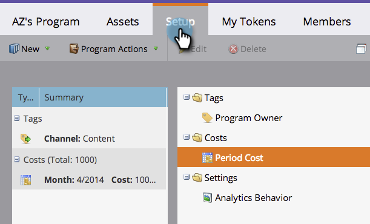

# Uso de Costes de Período en un Programa {#using-period-costs-in-a-program}

A [coste del período](/help/marketo/product-docs/core-marketo-concepts/programs/working-with-programs/understanding-period-costs.md) es la cantidad que gasta en un programa. Puede ser para uno o más meses y se utiliza para informar sobre el retorno de la inversión.

## Agregar un costo de período  {#add-a-period-cost}

1. Vaya a la **Configurar** de su programa.

   

1. Arrastrar y soltar **Costo de período** en el lienzo.

   

1. Haga clic en el icono de calendario. Seleccione un mes. Clic **OK**.

   

1. Introduzca una **Costo de período** (sin decimales ni comas). Clic **Guardar**.

   >[!NOTE]
   >
   >Esto puede ser una estimación. Siempre puede editar un coste de periodo una vez que sepa la cantidad exacta (consulte la siguiente sección).

   

1. El coste se muestra en el programa.

   

   >[!TIP]
   >
   >Puede arrastrar y soltar varios costes de período en el lienzo. Esto permite atribuir varios meses con diferentes costes de periodo al programa.

## Editar un coste de período {#edit-a-period-cost}

1. Si gasta más o menos dinero del previsto originalmente, puede editar el coste del periodo.

1. Vaya a la **Configurar** de su programa.

   

1. Haga clic con el botón derecho en **Costo de período**. Seleccionar **Editar**.

   

1. Realice las modificaciones que desee. Clic **Guardar**.

   

## Eliminar un coste de período {#delete-a-period-cost}

1. Vaya a la **Configurar** de su programa.

   

1. Haga clic con el botón derecho en **Costo de período**. Seleccionar **Eliminar**.

   

1. Clic **Eliminar** para confirmar.

   

>[!MORELIKETHIS]
>
>* [Explicación de Costes de Período](/help/marketo/product-docs/core-marketo-concepts/programs/working-with-programs/understanding-period-costs.md)
>* [Filtrado de un informe de programa por coste de período](/help/marketo/product-docs/core-marketo-concepts/programs/program-performance-report/filter-a-program-report-by-period-cost.md)
