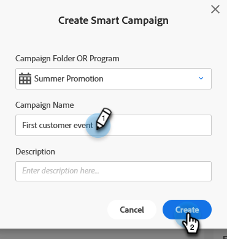

# Creación de una nueva campaña inteligente {#create-a-new-smart-campaign}

Las campañas inteligentes son la herramienta más importante de Marketo Engage. Pueden poner en déclencheur a una persona y realizar acciones, o reunir a millones de personas y ejecutar una serie de pasos de flujo.

>[!TIP]
>
>Más información sobre [Campañas inteligentes](/help/marketo/product-docs/core-marketo-concepts/smart-campaigns/understanding-smart-campaigns.md){target="_blank"}.

1. Ir a **Actividades de marketing**.

   

1. Haga clic con el botón derecho en el programa deseado y seleccione **Nueva campaña inteligente**.

   

   >[!TIP]
   >
   >Puede crear campañas inteligentes como recursos locales de cualquier programa.

1. Introduzca el nombre de la campaña inteligente y haga clic en **Crear**.

   

   A continuación, aprenda a definir qué personas desean ejecutar la campaña inteligente con una lista inteligente.

   >[!MORELIKETHIS]
   >
   >* [Definición de listas inteligentes para campañas inteligentes | Lote](/help/marketo/product-docs/core-marketo-concepts/smart-campaigns/creating-a-smart-campaign/define-smart-list-for-smart-campaign-batch.md){target="_blank"}
   >* [Definición de listas inteligentes para campañas inteligentes | DÉCLENCHEUR](/help/marketo/product-docs/core-marketo-concepts/smart-campaigns/creating-a-smart-campaign/define-smart-list-for-smart-campaign-trigger.md){target="_blank"}
