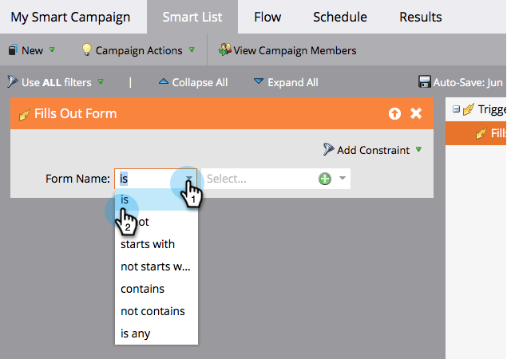

# Definición de listas inteligentes para campañas inteligentes | Déclencheur {#define-smart-list-for-smart-campaign-trigger}

Haga que una campaña inteligente se ejecute de a una persona a la vez en función de los eventos en directo mediante la adición de déclencheur.

>[!CAUTION]
>
>Realizar ediciones de listas inteligentes o pasos de flujo en una campaña activa puede dañar potencialmente su funcionalidad. Si decide hacerlo, proceda con precaución.

1. En la campaña inteligente, haga clic en **[!UICONTROL Lista inteligente]** pestaña.

   

1. Busque el déclencheur deseado y arrástrelo y suéltelo en el lienzo.

   

   >[!NOTE]
   >
   >Se ejecuta una campaña inteligente con déclencheur en _Déclencheur_ modo. Se ejecuta en una persona a la vez en función de los eventos activados y los filtros adicionales.

   >[!IMPORTANT]
   >
   >Al utilizar un campo booleano en una campaña de déclencheur Smart List, debe establecerlo explícitamente en &quot;false&quot; para que el campo se evalúe correctamente durante la ejecución de la campaña.

1. Haga clic en la lista desplegable y seleccione un operador.

   

   >[!CAUTION]
   >
   >Las líneas rojas onduladas indican errores o falta información. Si no se corrige, la campaña no será válida y no se ejecutará.

   >[!TIP]
   >
   >En una campaña inteligente con déclencheur y filtros, los déclencheur se colocan en la parte superior y, cuando se activan, solo las personas que cumplen los criterios de filtro pasan por el flujo.

1. Defina el déclencheur.

   

   >[!NOTE]
   >
   >Con varios déclencheur, una persona pasa por el flujo si _CUALQUIERA_ se activa uno de los déclencheur.

Para ejecutar la campaña en un conjunto de personas al mismo tiempo, aprenda a [Definición de listas inteligentes para campañas inteligentes | Lote](/help/marketo/product-docs/core-marketo-concepts/smart-campaigns/creating-a-smart-campaign/define-smart-list-for-smart-campaign-batch.md){target="_blank"}.

>[!MORELIKETHIS]
>
>[Adición de un paso de flujo a una campaña inteligente](/help/marketo/product-docs/core-marketo-concepts/smart-campaigns/flow-actions/add-a-flow-step-to-a-smart-campaign.md){target="_blank"}
