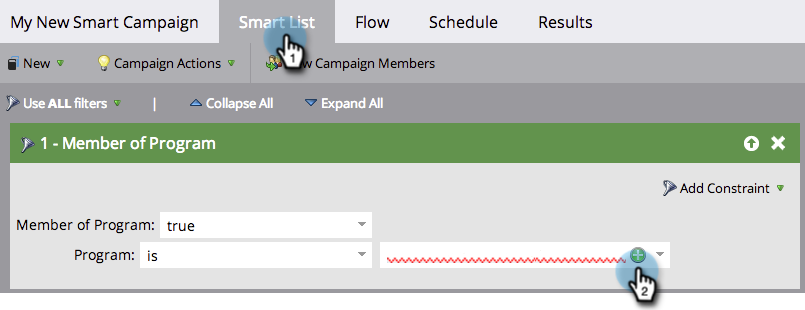
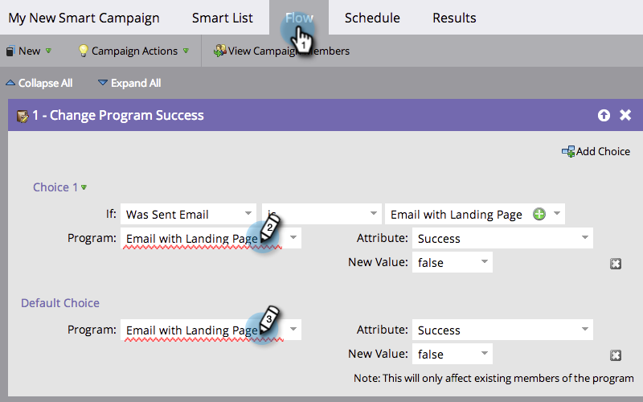

# Comprobación de la campaña inteligente {#smart-campaign-checklist}

Siga los siguientes pasos para garantizar un funcionamiento sin problemas de la campaña inteligente y evitar errores en la medida de lo posible.

## Eliminación de errores de listas inteligentes {#get-rid-of-smart-list-errors}

En su campaña inteligente, haga clic en **[!UICONTROL Smart List]**. Elimine cualquier línea roja ondulada que vea al corregir los errores.

>[!TIP]
>
>Las líneas rojas onduladas indican errores o falta información. Si no se corrige, la campaña no será válida y no se ejecutará.
>
>Además, mantenga las cosas simples. Si tiene docenas o cientos de filtros, es difícil mantenerlos y realizar un seguimiento. Menos filtros también son más rápidos de cargar.

>[!NOTE]
>
>El uso de **[!UICONTROL Member of Smart List]** podría contener errores en esa otra lista. Revisa allí también.

## Eliminación de errores de flujo {#get-rid-of-flow-errors}

En su campaña inteligente, haga clic en **[!UICONTROL Flujo]**. Elimine las líneas rojas onduladas que vea al corregir los errores.

>[!TIP]
>
>Pase el ratón sobre la línea roja ondulada para ver los detalles del error.

## Revise la pestaña Programación {#review-the-schedule-tab}

En la ficha **[!UICONTROL Programación]**, compruebe **[!UICONTROL Estado de la lista inteligente]** para ver si hay algún error en la campaña inteligente que deba corregirse.

## Comprobar límite de restricciones de persona {#check-person-restrictions-limit}

En la ficha **[!UICONTROL Programar]**, asegúrese de que el número de personas calificadas no supere el límite de restricción de personas.

>[!TIP]
>
>Si es necesario, puede [anular las restricciones de persona en una campaña inteligente](/help/marketo/product-docs/core-marketo-concepts/smart-campaigns/using-smart-campaigns/override-person-restrictions-in-a-smart-campaign.md).

>[!NOTE]
>
>**Recordatorio**
>
>Si su campaña inteligente sigue fallando, aprenda a [comprender las notificaciones](/help/marketo/product-docs/core-marketo-concepts/miscellaneous/understanding-notifications.md) para averiguar qué ha fallado y cómo solucionarlo.

¡Buen trabajo! Tenga esta lista de comprobación a mano antes de ejecutar una campaña inteligente.
