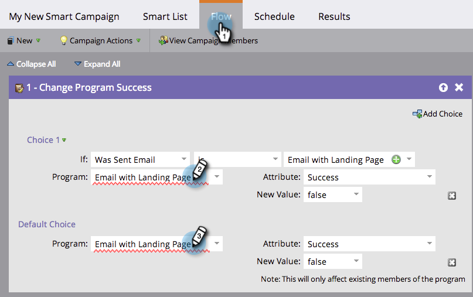
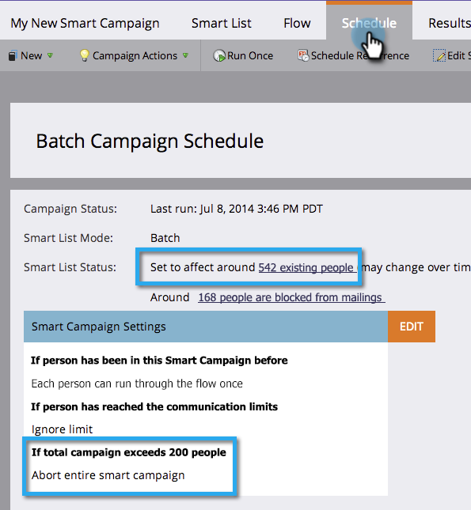

# Lista de comprobación de campañas inteligentes {#smart-campaign-checklist}

Siga los pasos a continuación para garantizar la ejecución sin problemas de la campaña inteligente y evitar errores en la medida de lo posible.

## Obtención de errores de listas inteligentes {#get-rid-of-smart-list-errors}

En la campaña inteligente, haga clic en **Lista inteligente**. Elimine cualquier línea roja que vea corrigiendo los errores.

>[!TIP]
>
>Las líneas rojas indican errores o falta información. Si no se corrige, la campaña no será válida y no se ejecutará.
>
>Además, **mantener las cosas simples**. Si tienes docenas o cientos de filtros, es difícil mantenerlo y seguirlo. También es más rápido cargar menos filtros.

>[!NOTE]
>
>Uso **Miembro de la lista inteligente** podría tener errores en esa otra lista. Compruebe allí también.

## Obtención de errores de flujo {#get-rid-of-flow-errors}

En la campaña inteligente, haga clic en **Flujo**. Elimine cualquier línea roja que vea corrigiendo los errores.

>[!TIP]
>
>Pase el ratón por encima de la línea roja y rápidamente para ver los detalles del error.

## Revisar la ficha Programación {#review-the-schedule-tab}

En el **Programación** , marque **Smart** **Lista** **Estado** para cualquier error en la campaña inteligente que deba corregirse.

## Comprobar límite de restricciones de persona {#check-person-restrictions-limit}

En el **Programación** , asegúrese de que el número de personas cualificadas no supere el límite de restricción de personas.

>[!TIP]
>
>Si es necesario, puede  [anular restricciones de persona en una campaña inteligente](/help/marketo/product-docs/core-marketo-concepts/smart-campaigns/using-smart-campaigns/override-person-restrictions-in-a-smart-campaign.md).

>[!NOTE]
>
>**Recordatorio**
>
>Si la campaña inteligente sigue fallando, aprenda a [comprender las notificaciones](/help/marketo/product-docs/core-marketo-concepts/miscellaneous/understanding-notifications.md) para averiguar qué salió mal y cómo corregirlo.

¡bueno trabajo! Mantenga esta lista de comprobación a mano antes de ejecutar una campaña inteligente.
