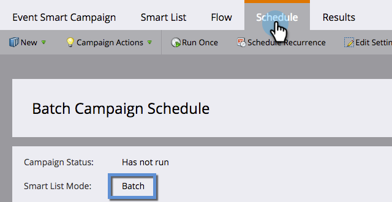

# Explicación de las campañas inteligentes por lotes y por Déclencheur {#understanding-batch-and-trigger-smart-campaigns}

Existen dos tipos de campañas inteligentes: Lote y Déclencheur.

## Campaña inteligente por lotes {#batch-smart-campaign}

>[!NOTE]
>
>**Definición**
>
>Una campaña por lotes se inicia a una hora específica y afecta a un conjunto específico de personas a la vez. Un ejemplo sería enviar un correo electrónico a todas las personas de California.

Las campañas inteligentes por lotes solo tendrán filtros dentro de la sección de listas inteligentes (es decir, sin déclencheur).

Al hacer clic en la pestaña **Schedule** se confirmará que la campaña inteligente está configurada como &quot;Batch&quot;.

**Lotes de campañas inteligentes**

* Se puede programar para recurrencias como diaria, semanal y mensual. También puede hacer que se ejecuten una sola vez.
* Se pueden ver en la [vista de programación del programa](/help/marketo/product-docs/core-marketo-concepts/programs/program-schedule-view/navigating-the-program-schedule-view.md). No se incluirá en la vista nada después de un paso &quot;Espera&quot; dentro de la campaña inteligente.

  

## Campaña inteligente de déclencheur {#trigger-smart-campaign}

>[!NOTE]
>
>**Definición**
>
>Una campaña inteligente de déclencheur afecta a una persona a la vez en función de un evento activado. Un ejemplo de déclencheur sería hacer clic en un vínculo de un correo electrónico.

Si una campaña inteligente utiliza al menos un déclencheur dentro de la sección de lista inteligente, el modo se establecerá automáticamente en activado.

Al hacer clic en la pestaña **Schedule** se confirmará que la campaña inteligente está configurada como &quot;Triggered&quot;.

**Campañas inteligentes de déclencheur**

* No se puede programar para recurrencias. Solo se pueden configurar como activas o inactivas.
* Puede configurar más de un déclencheur. Sin embargo, si se activa algún déclencheur, las acciones de campaña se ejecutarán.

>[!TIP]
>
>Utilice el [registro de actividad](/help/marketo/product-docs/core-marketo-concepts/smart-lists-and-static-lists/managing-people-in-smart-lists/locate-the-activity-log-for-a-person.md) para ver qué ha sucedido paso a paso en las campañas inteligentes. Puede encontrar el registro de actividad en la última pestaña de la página de detalles de una persona.
