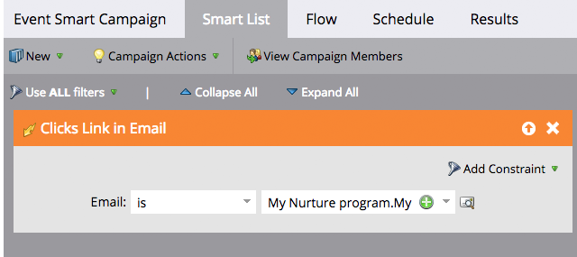

# Explicación de las campañas inteligentes por lotes y activación {#understanding-batch-and-trigger-smart-campaigns}

Existen dos tipos de campañas inteligentes: por lotes y por Déclencheur.

## Campaña por lotes {#batch-campaign}

>[!NOTE]
>
>**Definición**
>
>Una campaña por lotes se inicia a una hora específica y afecta a un conjunto específico de personas de una vez. Un ejemplo sería enviar un correo electrónico a todas las personas en California.

Las campañas por lotes solo tendrán filtros dentro de la sección de la lista inteligente (es decir, sin déclencheur).

Al hacer clic en la ficha **[!UICONTROL Programar]**, se confirmará que la campaña inteligente está configurada en &quot;Lote&quot;.

**Campañas inteligentes por lotes**

* Se puede programar para recurrencias, como diarias, semanales y mensuales. También puede hacer que se ejecuten solo una vez.
* Están visibles en la [vista de programación del programa](/help/marketo/product-docs/core-marketo-concepts/programs/program-schedule-view/navigating-the-program-schedule-view.md){target="_blank"}. No se incluirá en la vista nada después de un paso &quot;Espera&quot; dentro de la campaña inteligente.

  

## Campaña activadora {#trigger-campaign}

>[!NOTE]
>
>**Definición**
>
>Una campaña de Déclencheur afecta a una persona a la vez en función de un evento activado. Un ejemplo de déclencheur sería hacer clic en un vínculo de un correo electrónico.

Si una campaña inteligente utiliza al menos un déclencheur dentro de la sección de la lista inteligente, el modo se establecerá automáticamente como activado.

Al hacer clic en la ficha **[!UICONTROL Programar]**, se confirmará que la campaña inteligente está configurada como &quot;Activada&quot;.

**Campañas de Déclencheur**

* No se pueden programar para repeticiones. Solo se pueden establecer como activos o inactivos.
* Puede configurar más de un déclencheur. Sin embargo, si se activa algún déclencheur, las acciones de campaña se ejecutarán.

>[!TIP]
>
>Use el [registro de actividad](/help/marketo/product-docs/core-marketo-concepts/smart-lists-and-static-lists/managing-people-in-smart-lists/locate-the-activity-log-for-a-person.md){target="_blank"} para ver paso a paso qué ha sucedido en sus campañas inteligentes. Puede encontrar el registro de actividad en la última pestaña de la página de detalles de una persona.
