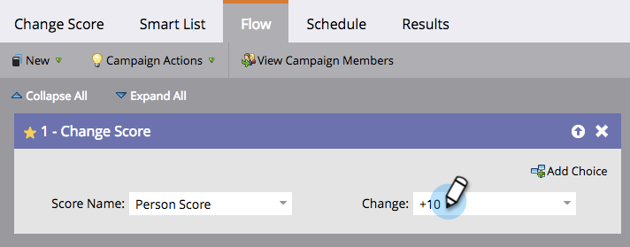

# Añadir un paso de flujo a una campaña inteligente {#add-a-flow-step-to-a-smart-campaign}

Los pasos de flujo le indican a Marketo lo que desea que le pase a un grupo de personas que cumplen los requisitos. Son sus instrucciones, y la campaña inteligente hará su oferta!

1. Vaya a **Marketing Activities**.

   

1. Seleccione la campaña inteligente y haga clic en **Flow**.

   

   Escriba para buscar un paso de flujo y arrástrelo y suéltelo al lienzo. Puede añadir varios pasos de flujo: repita esto con cada paso que desee que realice la campaña.

   

1. Haga clic en la lista desplegable y elija una opción adecuada.

   

1. Introduzca el valor.

   

>[!NOTE]
>
>Los pasos de flujo se ejecutan en el orden en que aparecen en la lista.  [Reordene los ](/help/marketo/product-docs/core-marketo-concepts/smart-campaigns/flow-actions/add-a-flow-step-to-a-smart-campaign/reorder-the-flow-steps-in-a-smart-campaign.md) pasos de flujo para asegurarse de que se encuentran en la secuencia correcta.

>[!TIP]
>
>Se muestra una línea roja de forma rápida en caso de una entrada no válida. Pase el ratón sobre la línea para ver cómo corregirla.

¡Increíble! Asegúrese de [revisar y validar la campaña inteligente](/help/marketo/product-docs/core-marketo-concepts/smart-campaigns/creating-a-smart-campaign/smart-campaign-checklist.md) antes de programarla o activarla.

>[!MORELIKETHIS]
>
>* [Uso de la opción Añadir en un paso de flujo](/help/marketo/product-docs/core-marketo-concepts/smart-campaigns/flow-actions/use-add-choice-in-a-flow-step.md)
>* [Reorganización de los pasos de flujo en una campaña inteligente](/help/marketo/product-docs/core-marketo-concepts/smart-campaigns/flow-actions/add-a-flow-step-to-a-smart-campaign/reorder-the-flow-steps-in-a-smart-campaign.md)

