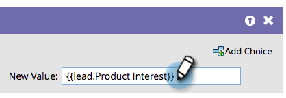

# Anexar datos a un campo {#append-data-to-a-field}

Existe una forma sencilla de anexar datos a un campo. Así es cómo se hace.

>[!PREREQUISITES]
>
>[Crear una campaña](/help/marketo/product-docs/core-marketo-concepts/smart-campaigns/creating-a-smart-campaign/create-a-new-smart-campaign.md){target="_blank"}

>[!NOTE]
>
>Los pasos siguientes también se aplican a [Cambiar datos de miembros del programa](/help/marketo/product-docs/core-marketo-concepts/smart-campaigns/program-flow-actions/change-program-member-data.md){target="_blank"}.

1. En la ficha **[!UICONTROL Flujo]**, arrastre el paso de flujo **[!UICONTROL Cambiar valor de datos]**.

   

1. Busque y seleccione el campo al que desee anexar datos.

   

1. Busque y seleccione el token para el mismo campo al que desee anexar datos.

   

1. Ahora añada el valor que desea anexar a lo que ya existe en el campo.

   

¡Ya está! Puede ser más creativo y agregar varios tokens allí.
