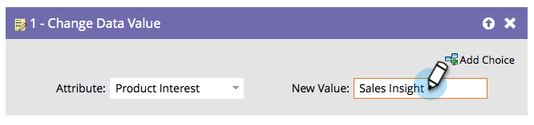

# Cambiar valor de datos {#change-data-value}

Puede utilizar Marketo para actualizar el valor de un campo. Para ello, usará la acción de flujo **[!UICONTROL Cambiar valor de datos]**.

>[!NOTE]
>
>También puede bloquear la actualización de un campo. Consulte [Bloquear actualizaciones de un campo](/help/marketo/product-docs/administration/field-management/block-updates-to-a-field.md){target="_blank"} para obtener más información.

1. Busque y seleccione el campo cuyo valor desea cambiar.

   

1. Introduzca el valor deseado.

   

   >[!NOTE]
   >
   >También puede usar tokens en **[!UICONTROL Nuevo valor]**.

   >[!TIP]
   >
   >Puede escribir &quot;NULL&quot; (sin comillas, mayúsculas) en **[!UICONTROL Nuevo valor]** para borrar el campo. Consulte [Borrar valores de campo](/help/marketo/product-docs/core-marketo-concepts/smart-campaigns/flow-actions/clear-field-values.md){target="_blank"} para obtener detalles.

   >[!NOTE]
   >
   >* [Tokens para pasos de flujo](/help/marketo/product-docs/core-marketo-concepts/smart-campaigns/flow-actions/use-tokens-in-flow-steps.md){target="_blank"}
   >* [Anexar datos a un campo](/help/marketo/product-docs/core-marketo-concepts/smart-campaigns/flow-actions/append-data-to-a-field.md){target="_blank"}
