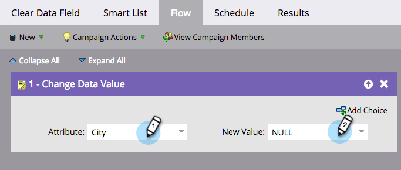

# Borrar valores de campo {#clear-field-values}

[Cambiar valor de datos](/help/marketo/product-docs/core-marketo-concepts/smart-campaigns/flow-actions/change-data-value.md) es genial, pero ¿cómo _quitas_ el valor por completo? ¡Buena pregunta!

1. En el paso de flujo, elija el campo que desea borrar y escriba **[!UICONTROL NULL]** (mayúsculas) como **[!UICONTROL Nuevo valor]**.

   

1. Una vez finalizado el paso de flujo, se borra el valor del campo seleccionado.

   

   >[!CAUTION]
   >
   >Si deja el nuevo valor en blanco o simplemente introduce un ESPACIO, el campo no se vaciará. Tiene que escribir NULL. Además, recuerde, los pasos de flujo no se pueden deshacer después de ejecutar.
