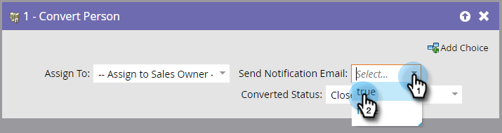

# Convertir Persona {#convert-person}

Utilice este paso de flujo para convertir a una persona en un contacto de [!DNL Salesforce]. Puede decidir a quién asignar el contacto, enviar una notificación al propietario y establecer un estado convertido.

>[!NOTE]
>
>Esto solo está disponible cuando se integra con [!DNL Salesforce].

1. Seleccione a quién desea asignar el contacto, la cuenta y la oportunidad resultantes.

   

   >[!CAUTION]
   >
   >Convertir a una persona en Marketo resultará en una nueva cuenta y oportunidad en [!DNL Salesforce]. Si no desea cuentas duplicadas, use [!DNL Salesforce] para convertir.

1. Elija si desea que se envíe una **[!UICONTROL notificación]** al propietario o no.

   

1. Seleccione el **[!UICONTROL estado convertido]**.

   
