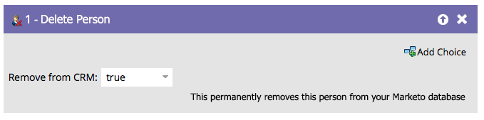

# Eliminar persona {#delete-person}

A veces las personas erróneas entran en la base de datos. El paso Eliminar flujo de persona puede eliminarlos.

## Información general {#overview}

Utilice el paso de flujo en una campaña inteligente.

>[!CAUTION]
>
>Al eliminar una persona, también se eliminarán todos sus datos históricos del RCE. No se puede deshacer.

## Uso {#usage}

Cuando arrastre el paso de flujo, se establecerá automáticamente para eliminarlo de su CRM también.

Puede eliminar de Marketo y no de su CRM, de este modo:

>[!NOTE]
>
>Eliminar a la persona de su CRM **solo funciona con Salesforce**. Si elimina una persona de Marketo y decide mantenerla en Salesforce, se recrearán en Marketo si el registro de Salesforce se actualiza alguna vez.
