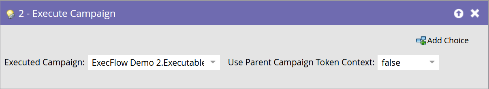

# Ejecutar campaña {#execute-campaign}

Una campaña ejecutable, al igual que otras campañas, contiene una lista inteligente, un flujo y una programación. A diferencia de otras campañas, en realidad no la programa ni la activa. Solo se puede llamar a través de otra campaña a través del paso Ejecutar flujo de campaña . Los pasos de flujo de la campaña ejecutable se ejecutan en serie con la campaña principal (a diferencia de la campaña de solicitud, que se ejecuta en paralelo en una campaña de Déclencheur independiente).

>[!NOTE]
>
>Esta función se habilitará para todas las instancias de Marketo la tarde del martes 11 de mayo.

>[!NOTE]
>
>Las campañas ejecutables siempre son secundarias de la campaña (principal) que las llama.

## Cuándo utilizar Ejecutar campaña {#when-to-use-execute-campaign}

Puede hacer muchas cosas con una campaña ejecutable. Están diseñadas para facilitar tareas operativas comunes, como enrutamiento de posibles clientes, administración del ciclo de vida y puntuación (entre otras), y pueden utilizarse para ejecutar el mismo flujo de trabajo desde lotes o campañas activadas.

También puede utilizarlos cuando necesite ejecutar un flujo independiente, pero debe depender de los resultados de ese flujo en las siguientes opciones de paso de flujo (es decir, si esto sucede, haga eso).

Ejecutar campaña es una mejora respecto a [Solicitar campaña](/help/marketo/product-docs/core-marketo-concepts/smart-campaigns/flow-actions/request-campaign.md), ya que puede ejecutarse en serie o en paralelo, mientras que esta última solo se ejecuta en paralelo.

>[!NOTE]
>
>Los pasos de espera y los Webhooks nunca serán compatibles con las campañas ejecutables. Para estos, deberá usar Campaña de solicitud en su lugar.

## Cómo crear una campaña ejecutable {#how-to-create-an-executable-campaign}

1. Haga clic con el botón derecho en el programa deseado y seleccione **New Smart Campaign**.

   

1. Asígnele un nombre, seleccione la casilla **Ejecutable** y haga clic en **Crear**.

   

1. Defina la lista inteligente y el flujo, como cualquier otra campaña inteligente.

También puede clonar una campaña inteligente existente. Si clona una campaña ejecutable existente, tendrá que seleccionar la casilla **Ejecutable** después de ponerle nombre.

>[!NOTE]
>
>No puede clonar una campaña que contenga déclencheur.

## Usar contexto de token de campaña principal {#use-parent-campaign-token-context}

Cuando se establece en true, los siguientes contextos de token se envían a la campaña secundaria (la que se está ejecutando):

* Mis tokens
* Tokens de campaña
* Tokens del programa
* Tokens de miembro
* [Tokens de déclencheur](/help/marketo/product-docs/marketo-sales-insight/msi-for-salesforce/features/tabs-in-the-msi-panel/interesting-moments/trigger-tokens-for-interesting-moments.md)  (si se llaman desde una campaña activada)

**Interacción de API**

Al utilizar Programar o Solicitar campaña [en la API](https://developers.marketo.com/rest-api/assets/smart-campaigns/#batch), ambos permiten pasar valores para Mis tokens, lo que anula los valores establecidos para esos tokens en la campaña a la que está llamando. Si esa campaña luego ejecuta otra campaña y establece &quot;Usar contexto principal en verdadero&quot;, utilizará los valores pasados a través de la API, en lugar de los valores configurados en la aplicación.

## Aspectos a tener en cuenta {#things-to-note}

* La lista inteligente filtrará a cualquier persona que no cumpla los requisitos. Si una persona cumple los requisitos, el registro de actividad de la campaña ejecutada resultante los enumerará como &quot;Calificado: TRUE&quot; (y FALSE si no lo hacen)
* Se aplican las reglas de clasificación de programación de campaña (Configuración de campaña inteligente en la pestaña Programación ).
* No se pueden llamar a las campañas ejecutables entre espacios de trabajo
* Si utiliza la acción de flujo [Remove from Flow](/help/marketo/product-docs/core-marketo-concepts/smart-campaigns/flow-actions/remove-from-flow.md) dirigida a una campaña ejecutable, se dirigirá tanto al secundario como al principal
* Aprovechando la herencia de tokens : por ejemplo, si tiene un único flujo de puntuación común activado por varios recursos diferentes, puede definir una puntuación predeterminada My Token en la campaña secundaria y en la campaña principal para que pueda anular el valor de la campaña de puntuación secundaria en las campañas principales (consulte a continuación un ejemplo visual)
* La anidación de campañas ejecutables no está disponible en este momento, pero estará en una versión próxima

>[!CAUTION]
>
>Nunca deje inválidas las listas inteligentes para campañas ejecutables; de lo contrario, **nadie** cumplirá los requisitos para ello. Una práctica recomendada es crear recursos de listas inteligentes independientes, definirlos por completo y asegurarse de que son válidos. A continuación, utilice el filtro &quot;Miembro de la lista inteligente&quot; en la campaña ejecutable para que pueda intercambiar la definición de la lista inteligente.

## Ejemplo de herencia de tokens {#token-inheritance-example}

A continuación se muestra un ejemplo visual de la herencia de tokens en una campaña ejecutable y dos campañas principales: uno con contexto de token establecido en **True** y el otro en **False**.

Campaña secundaria con una puntuación de cambio mediante un token.

La campaña infantil es My Tokens.

**Ejemplo 1 - Verdadero**

En el paso Ejecutar campaña de la primera campaña principal, el valor &quot;Usar contexto de token de campaña principal&quot; se establece en **True**.

Mis tokens de la campaña principal.

Los resultados: la puntuación ha cambiado en +10.

**Ejemplo 2: False**

En el filtro Ejecutar campaña de la segunda campaña principal, el valor &quot;Usar contexto de token de campaña principal&quot; se establece en **False**.

Mis tokens de la campaña principal.

Los resultados: puntuación sin modificar, ya que se utilizó el valor de puntuación de la campaña secundaria, +0.

