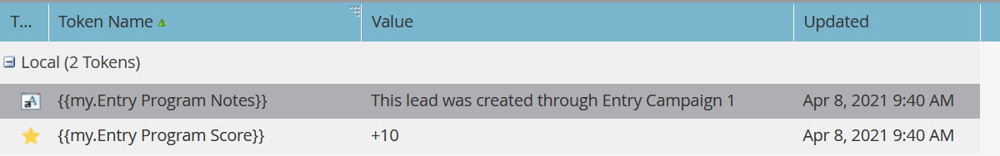
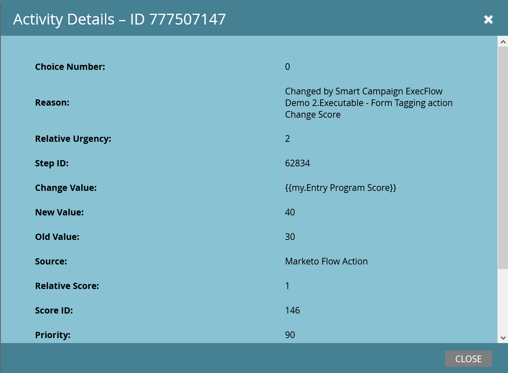

# Ejecutar campaña {#execute-campaign}

Una campaña ejecutable, como otras campañas, contiene una lista inteligente, un flujo y un programa. A diferencia de otras campañas, en realidad no se programa ni se activa. Solo otra campaña puede llamarla a través del paso Ejecutar flujo de campaña. Los pasos de flujo de la campaña ejecutable se ejecutan en serie con la campaña principal (a diferencia de la campaña de solicitud, que se ejecuta en paralelo en una campaña de Déclencheur independiente).

>[!NOTE]
>
>Las campañas ejecutables siempre son secundarias de la campaña (principal) que las llama.

## Cuándo utilizar Ejecutar campaña {#when-to-use-execute-campaign}

Hay muchas cosas que puede hacer con una campaña ejecutable. Están diseñadas para facilitar tareas operativas comunes, como el enrutamiento de posibles clientes, la administración del ciclo vital y la puntuación (entre otras), y se pueden utilizar para ejecutar el mismo flujo de trabajo desde Lote o Campañas activadas.

También puede utilizarlos cuando necesite ejecutar un flujo independiente, pero debe depender de los resultados de ese flujo en las opciones de paso de flujo subsiguientes (es decir, si es así, hágalo).

Ejecutar campaña es una mejora con [Solicitar campaña](/help/marketo/product-docs/core-marketo-concepts/smart-campaigns/flow-actions/request-campaign.md), ya que puede ejecutarse en serie, mientras que esta última solo se ejecuta en paralelo.

>[!NOTE]
>
>Los pasos de espera y los webhooks nunca serán compatibles con las campañas ejecutables. Para ello, debe utilizar Solicitar campaña en su lugar.

## Cómo crear una campaña ejecutable {#how-to-create-an-executable-campaign}

1. Haga clic con el botón derecho en el programa que desee y seleccione **[!UICONTROL Nueva campaña inteligente]**.

   

1. Asigne un nombre, seleccione la casilla de verificación **[!UICONTROL Ejecutable]** y haga clic en **[!UICONTROL Crear]**.

   

1. Defina la lista inteligente y el flujo, como cualquier otra campaña inteligente.

También puede clonar una campaña inteligente existente. Si clona una campaña ejecutable existente, aún tendrá que seleccionar la casilla de verificación **[!UICONTROL Ejecutable]** después de asignarle un nombre.

>[!NOTE]
>
>No puede clonar una campaña que contenga déclencheur.

## Utilizar el contexto del token de campaña principal {#use-parent-campaign-token-context}

Cuando se establece en true, se envían los siguientes contextos de token a la campaña secundaria (la que se está ejecutando):

* Mis tokens
* Tokens de campaña
* Tokens de programa
* Tokens de miembros
* [Tokens de Déclencheur](/help/marketo/product-docs/marketo-sales-insight/msi-for-salesforce/features/tabs-in-the-msi-panel/interesting-moments/trigger-tokens-for-interesting-moments.md) (si se llaman desde una campaña activada)

**Interacción de API**

Al usar Programar o Solicitar campaña [en la API](https://experienceleague.adobe.com/es/docs/marketo-developer/marketo/rest/assets/smart-campaigns#batch), ambos le permiten pasar valores para Mis tokens, lo que anula los valores establecidos para esos tokens en la campaña a la que llama. Si esa campaña ejecuta otra campaña y establece &quot;Use Parent Context to True&quot;, utilizará los valores pasados a través de la API en lugar de los valores establecidos en la aplicación.

## Cosas que hay que tener en cuenta {#things-to-note}

* La lista inteligente filtrará a cualquier persona que no cumpla los requisitos. Si una persona cumple los requisitos, el registro de actividad de Campaña ejecutada resultante los enumerará como &quot;Cualificado: VERDADERO&quot; (y FALSO si no lo hace)
* Se aplican reglas de calificación de programación de campaña (Configuración de campaña inteligente en la pestaña Programar )
* No se puede llamar a las campañas ejecutables en espacios de trabajo
* Si usa la acción de flujo [Quitar del flujo](/help/marketo/product-docs/core-marketo-concepts/smart-campaigns/flow-actions/remove-from-flow.md) dirigida a una campaña ejecutable, se dirigirá tanto al elemento secundario como al principal
* Aprovechar la herencia de tokens: por ejemplo, si tiene un solo flujo de puntuación común activado por varios recursos diferentes, puede definir una puntuación de Mi token predeterminada en la campaña secundaria y en la campaña principal para que pueda anular el valor de campaña de puntuación secundaria de sus campañas principales (consulte a continuación para ver un ejemplo visual)
* Las campañas ejecutables pueden llamarse hasta tres niveles (por ejemplo, Campaña principal > Secundario > Secundario > Secundario)

>[!CAUTION]
>
>Nunca dejes inválidas tus listas inteligentes para Campañas ejecutables, de lo contrario _nadie_ cumplirá los requisitos para ello. La práctica recomendada es crear recursos de listas inteligentes independientes, definirlos por completo y asegurarse de que son válidos. A continuación, utilice el filtro &quot;Miembro de la lista inteligente&quot; en la campaña ejecutable para poder intercambiar la definición de la lista inteligente.

## Ejemplo de herencia de token {#token-inheritance-example}

A continuación se muestra un ejemplo visual de la herencia de tokens en una campaña ejecutable y dos campañas principales: una con el contexto de tokens establecido en **[!UICONTROL True]** y otra en **[!UICONTROL False]**.

Campaña secundaria con una puntuación de cambio identificada.

La campaña infantil es Mis tokens.

### Ejemplo 1: Verdadero {#example-one-true}

En el paso Ejecutar flujo de campaña de la primera campaña principal, &quot;Usar contexto de token de campaña principal&quot; se establece en **True**.

La campaña de los padres es Mis tokens.

Los resultados: la puntuación cambió en +10.

### Ejemplo 2: False {#example-two-false}

En el paso Ejecutar flujo de campaña de la segunda campaña principal, &quot;Usar contexto de token de campaña principal&quot; se establece en **False**.

La campaña de los padres es Mis tokens.

Resultados: la puntuación no se ha modificado porque se ha utilizado el valor de puntuación de la campaña secundaria, +0.

