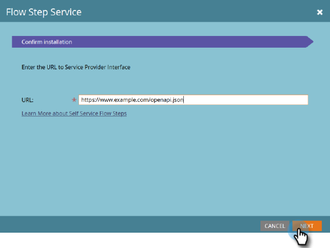

# Servicio de pasos de flujo {#flow-step-service}

>[!NOTE]
>
>Los pasos de flujo de autoservicio se encuentran actualmente en fase beta abierta. Puede activarlo para su suscripción en el menú Administración > Tesoro de comprobación .

Los pasos de flujo de autoservicio son un marco y un conjunto de funciones para la creación, publicación e integración de servicios web en las campañas inteligentes del Marketo Engage de Adobe. Esta guía está dirigida a los usuarios finales Marketo Engage que deseen instalar y utilizar servicios que ya se hayan creado y publicado. Para obtener información sobre la creación y publicación de su propio servicio, consulte la [Repositorio de GitHub para la interfaz del proveedor de servicios](https://github.com/adobe/Marketo-SSFS-Service-Provider-Interface){target=&quot;_blank&quot;}. Se puede encontrar una implementación de tabla de búsqueda de prueba de concepto [here](https://github.com/adobe/mkto-flow-lookup){target=&quot;_blank&quot;}.

## Restricciones y advertencias previas al lanzamiento {#pre-release-restrictions-and-warnings}

Actualmente, esta función está en fase beta abierta y solo debe utilizarse en instancias de Marketo Engage de Sandbox hasta que el servicio se haya probado completamente.

## Incorporación y administración de servicios {#onboarding-and-managing-services}

La instalación de un paso de flujo personalizado requiere permisos de administrador en Marketo (**Administrar vínculos web** en la versión del 21 de enero, que cambia en la versión del 11 de marzo). Aparte de la URL de instalación, todos los demás aspectos de un servicio se pueden editar después de completar la incorporación inicial explorando en la pantalla de detalles del servicio desde la cuadrícula Proveedores de servicios.

## URL de instalación {#installation-url}

Para comenzar la instalación, primero debe obtener la URL del documento OpenAPI que define el servicio. Su proveedor de servicios debe poder proporcionárselo y normalmente tendrá una URL que termine en `/openapi.json`. Las direcciones URL completas tendrán un aspecto similar al siguiente `https://www.example.com/OpenAPI.json`. Una vez que tenga esta dirección URL, vaya al menú Proveedores de servicios de su sección de administración.

Haga clic en **Siguiente** para ir a la sección Introducir credenciales del servicio .

## Introducir credenciales de servicio {#enter-service-credentials}

Para acceder al servicio que se está instalando, Marketo debe tener credenciales de API válidas. Su proveedor de servicios debe proporcionarle estas credenciales. Los servicios tienen tres opciones de autenticación diferentes, por lo que es posible que vea una de las tres solicitudes de credenciales diferentes: **Clave de API** que solo tiene un campo de entrada, **Autenticación básica** que requiere un nombre de usuario y una contraseña y también puede requerir un campo denominado Territorio, y **OAuth2** usando la variable _Credenciales del cliente_ subvención, que requiere un _ID de cliente_ y _Secreto del cliente_.

>[!NOTE]
>
>OAuth2 no estará disponible hasta la versión del 11 de marzo.

Al guardar las credenciales, Marketo intentará llamar al extremo de estado del servicio para comprobar que son válidas. Si las credenciales proporcionadas no son válidas, verá un error que lo indicará.

## Guía de incorporación (opcional) {#onboarding-guide}

Algunos proveedores de servicios incluirán un paso opcional de Guía de incorporación. Este paso incluirá cualquier instrucción adicional para completar la incorporación de servicio que sea específica para ese servicio.

## Asignación de campos {#field-mapping}

Para recibir o devolver datos de un campo de posibles clientes específico, se debe asignar ese campo. Aunque la asignación es un paso necesario durante la incorporación, siempre puede volver para modificar las asignaciones más adelante. Existen dos tipos de asignaciones que se configuran en pantallas independientes: **Campos salientes**, que se envían al servicio cuando Marketo invoca el paso de flujo, y **Campos entrantes** que son campos que pueden recibir datos del servicio cuando devuelve datos a Marketo.

>[!NOTE]
>
>Al asignar un campo saliente, se concede a Marketo permiso para transmitir datos de ese campo relacionados con posibles clientes que procesa el servicio asociado. Asegúrese de que tiene la autoridad y la autoridad legales adecuadas para transmitir estos datos a su proveedor de servicios, ya que estos campos pueden incluir información de identificación personal cubierta por las leyes de privacidad de datos, protección y arrendamiento.

Es posible que las asignaciones de campo opcionales se deshabiliten sin interrumpir el servicio, pero es posible que las asignaciones necesarias no se eliminen ni se desactiven por completo.

## Asignaciones impulsadas por servicios {#service-driven-mappings}

Los servicios que tienen un conjunto fijo de entradas y salidas, como un paso de flujo de registro de eventos, utilizan **Asignaciones impulsadas por servicios**. Para este tipo de asignación, el proveedor de servicios proporciona un tipo de datos y una sugerencia en forma de nombre de API. Si la sugerencia coincide con el nombre de API de un campo de posible cliente existente, ese campo se rellenará automáticamente en la sección de asignación. Para los campos sin una sugerencia coincidente, deberá rellenar la asignación manualmente desde la lista de campos con el tipo de datos coincidente. Las asignaciones necesarias deben rellenarse para completar la incorporación.

## Asignaciones impulsadas por el usuario {#user-driven-mappings}

Los servicios que no tienen un conjunto fijo de entradas y salidas, como un servicio de formato de fecha, utilizan **Asignaciones impulsadas por el usuario**. Esto significa que un administrador debe configurar cada campo entrante y saliente.

## Campos salientes {#outgoing-fields}

Los campos salientes son los que se envían al servicio de paso de flujo cuando ese paso de flujo se utiliza en una campaña inteligente.

## Campos entrantes {#incoming-fields}

Los campos entrantes son aquellos en los que el servicio de paso de flujo puede escribir datos.

## Opciones de configuración (opcional) {#configuration-options}

Algunos servicios tienen opciones de configuración global opcionales o requeridas. Si se requiere alguna opción, se debe configurar un valor para todas las opciones necesarias antes de guardar o completar la incorporación. Los parámetros cuyos nombres están en cursiva se envían al servicio invocado como encabezados.

## Retirada de un servicio {#retiring-a-service}

Para facilitar las transiciones a versiones nuevas o alternativas de un servicio, sin interrumpir el uso activo, los servicios se pueden retirar del menú Proveedores de Servicios. **Retirada de un servicio** quita el paso de flujo correspondiente de la paleta Flujo de campaña inteligente, de modo que no se puedan crear nuevos usos. En la mayoría de los casos, debe tener un servicio de reemplazo listo para reemplazar el existente cuando elija retirar un servicio.

## Desaprobación del servicio {#service-deprecation}

A veces, los proveedores de servicios necesitarán eliminar los servicios de paso de flujo como parte normal del ciclo de vida del software. Cuando un proveedor de servicios lo anuncia, la fecha de desaprobación y el mensaje se rellenan en la vista de cuadrícula de proveedores de servicios. Si continúa utilizando un servicio en desuso, puede provocar interrupciones del servicio si ya no responde de la manera esperada o deja de aceptar solicitudes de Marketo Smart Campaigns, por lo que debe prestar especial atención a cualquier notificación de desaprobación del servicio que reciba y tomar las medidas adecuadas para retirarse o reemplazar los pasos del servicio que aún estén en uso.

## Uso de pasos de flujo personalizados y de terceros {#using-third-party-and-custom-flow-steps}

Los pasos de flujo instalados se pueden utilizar en gran medida del mismo modo que los pasos de flujo estándar. Todos los parámetros de flujo definidos por el servicio se presentan a los usuarios finales.

## Actualización de listas de reproducción {#refreshing-picklists}

Marketo actualizará las opciones de la lista de selección para los servicios cada noche, pero hay momentos en que necesitará nuevas opciones disponibles, como la creación de campañas. Puede actualizarlos fácilmente desde cualquier instancia del paso de flujo mediante el botón de actualización o accediendo al menú Administración > Proveedores de servicios y haciendo clic en Actualizar lista de selección una vez que haya seleccionado el servicio.

## Comprobación de campos entrantes {#checking-incoming-fields}

Puede comprobar qué campos entrantes están configurados para un paso de flujo determinado pasando el puntero sobre su icono de información de objeto. Esto resulta útil para determinar qué campos pueden cambiar cuando un posible cliente pasa por él, por lo que puede configurar opciones en pasos posteriores utilizando esos campos.

## Campos entrantes y cambios en el valor de los datos {#incoming-fields-and-data-value-changes}

A diferencia de la mayoría de los demás pasos de flujo, los implementados con el marco de SSFS pueden escribir datos en los campos de posibles clientes que son asignados por un administrador y registrar esos cambios como actividades de cambio de valor de datos .  Cuando un paso de flujo escribe los datos de este modo, todos esos cambios se completarán antes de que la campaña inteligente siga cualquier paso posterior, de modo que los datos escritos puedan depender de las siguientes opciones de paso de flujo.

## Registros y estadísticas de servicio {#service-logs-and-statistics}

Cada servicio de paso de flujo tiene varios tipos de registro asociados para ayudar a supervisar el estado y solucionar cualquier problema relacionado con la integración.

## Estadísticas de servicio {#service-statistics}

El registro de estadísticas de servicio agrega los resultados de invocaciones y devoluciones de llamadas para cada servicio. Se agrupan por tiempo, nivel (fragmento o registro) y código, y proporcionan recuentos y el mensaje de registro más reciente para cada código recibido. Este tablero está diseñado principalmente para ayudar a supervisar la salud de los servicios.
