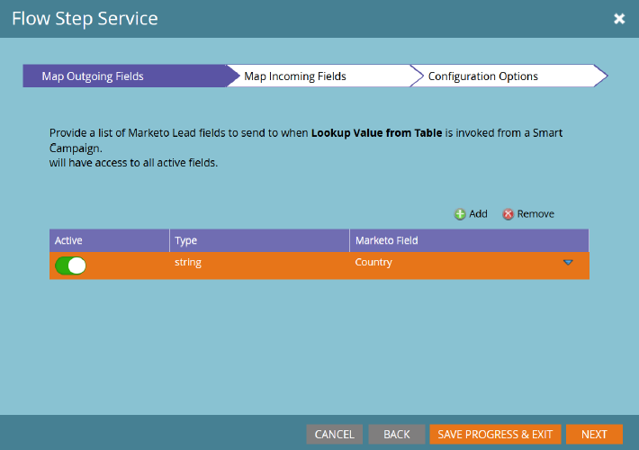

# Servicio de paso de flujo {#flow-step-service}

Pasos de flujo de autoservicio es un marco y un conjunto de funciones para la creación, publicación e integración de servicios web en campañas inteligentes de Adobe Marketo Engage. Esta guía está destinada a los usuarios finales Marketo Engage que desean instalar y utilizar servicios que ya se han creado y publicado. Para obtener información sobre cómo crear y publicar su propio servicio, consulte el [repositorio de GitHub para la interfaz de Service Provider](https://github.com/adobe/Marketo-SSFS-Service-Provider-Interface){target="_blank"}. Se puede encontrar una implementación de tabla de búsqueda de prueba de concepto [aquí](https://github.com/adobe/mkto-flow-lookup){target="_blank"}.

## Incorporación y administración de servicios {#onboarding-and-managing-services}

La instalación de un paso de flujo personalizado requiere permisos de administración en Marketo. Aparte de la URL de instalación, todos los demás aspectos de un servicio atendido pueden editarse después de completar la incorporación inicial explorando en la pantalla de detalles del servicio desde la cuadrícula de los proveedores de servicios.

## URL de instalación {#installation-url}

Para comenzar la instalación, primero deberá obtener la URL del documento de OpenAPI que define su servicio. Su proveedor de servicios debe poder proporcionarle esto y normalmente tendrá una dirección URL que termina en `/openapi.json`. Las direcciones URL completas se parecerán a `https://www.example.com/OpenAPI.json`. Una vez que tenga esta URL, vaya al menú Service Providers en la sección Admin.

Haga clic en **[!UICONTROL Siguiente]** para ir a la sección Introducir credenciales de servicio.

## Introducir credenciales de servicio {#enter-service-credentials}

Para acceder al servicio que se está instalando, Marketo debe tener credenciales de API válidas. El proveedor de servicios debe proporcionarle estas credenciales. Los servicios tienen tres opciones de autenticación diferentes, por lo que puede que vea una de las tres solicitudes de credenciales diferentes: **Clave de API** que tiene un solo campo de entrada, **Autenticación básica** que requiere un nombre de usuario y una contraseña y que también puede requerir un campo llamado Dominio, y **OAuth2** que usa la concesión de _Credenciales del cliente_, que requiere un _ID del cliente_ y _Secreto del cliente_.

Al guardar las credenciales, Marketo intentará llamar al extremo de estado del servicio para comprobar que son válidas. Si las credenciales proporcionadas no son válidas, aparecerá un error que lo indica.

>[!CAUTION]
>
>Si se crea y elimina un proveedor de servicios, no podrá volver a utilizar su nombre de proveedor de servicios, API, Déclencheur o filtro a partir de ahora.

## Guía de incorporación (opcional) {#onboarding-guide}

Algunos proveedores de servicios incluirán un paso opcional de la Guía de incorporación. Este paso incluirá cualquier instrucción adicional para completar la incorporación al servicio que sea específica de ese servicio.

## Asignación de campos {#field-mapping}

Para recibir o devolver datos de un campo de posible cliente específico, ese campo debe asignarse. Aunque la asignación es un paso necesario durante la incorporación, siempre puede volver para modificar las asignaciones más adelante. Existen dos tipos de asignaciones configuradas en pantallas independientes: **Campos salientes**, que se envían al servicio cuando Marketo invoca el paso de flujo, y **Campos entrantes**, que son campos que pueden recibir datos del servicio cuando devuelve datos a Marketo.

>[!NOTE]
>
>Al asignar un campo saliente, se concede permiso a Marketo para transmitir datos de ese campo relacionados con los posibles clientes procesados por el servicio asociado. Asegúrese de que tiene la capacidad legal y la autoridad adecuadas para transmitir estos datos a su proveedor de servicios, ya que estos campos pueden incluir información de identificación personal cubierta por las leyes de privacidad de datos, protección y tenencia.

Las asignaciones de campos opcionales pueden deshabilitarse sin interrumpir el servicio, pero las asignaciones requeridas no pueden eliminarse ni desactivarse por completo.

## Asignaciones gobernadas por servicio {#service-driven-mappings}

Los servicios que tienen un conjunto fijo de entradas y salidas, como un paso de flujo de registro de evento, utilizan **Asignaciones impulsadas por servicio**. Para este tipo de asignación, el proveedor de servicios proporcionará un tipo de datos y una sugerencia en forma de nombre de API. Si la sugerencia coincide con el nombre de la API de un campo de posible cliente existente, ese campo se rellenará automáticamente en la sección de asignación. Para los campos sin una sugerencia coincidente, deberá rellenar la asignación manualmente desde la lista de campos con el tipo de datos coincidente. Las asignaciones necesarias deben rellenarse para completar la incorporación.

## Asignaciones Dirigidas Por El Usuario {#user-driven-mappings}

Los servicios que no tienen un conjunto fijo de entradas y salidas, como un servicio de formato de fecha, utilizan **Asignaciones dirigidas por el usuario**. Esto significa que cada campo entrante y saliente debe configurarlo un administrador.

## Campos salientes {#outgoing-fields}

Los campos de salida son aquellos que se envían al servicio de pasos de flujo cuando ese paso de flujo se utiliza en una campaña inteligente.

## Campos entrantes {#incoming-fields}

Los campos entrantes son aquellos en los que el servicio de pasos de flujo puede escribir datos.

## Opciones de configuración (opcional) {#configuration-options}

Algunos servicios tienen opciones de configuración global opcionales o requeridas. Si se requiere alguna opción, se debe establecer un valor para todas las opciones necesarias antes de guardar o completar la incorporación. Los parámetros cuyos nombres están en cursiva se envían al servicio invocado como encabezados.

## Retirada de un servicio {#retiring-a-service}

Para facilitar las transiciones a versiones nuevas o alternativas de un servicio, sin interrumpir el uso activo, los servicios se pueden retirar del menú Proveedores de servicios. **Al retirar un servicio**, se quita el paso de flujo correspondiente de la paleta Flujo de campaña inteligente, de modo que no se puedan crear nuevos usos del mismo. En la mayoría de los casos, debe tener un servicio de reemplazo listo para reemplazar el existente cuando decida retirar un servicio.

## Obsolescencia del servicio {#service-deprecation}

A veces, los proveedores de servicios necesitarán dejar de utilizar los servicios de paso de flujo como parte normal del ciclo de vida del software. Cuando un proveedor de servicios lo anuncia, la fecha y el mensaje de obsolescencia se rellenan en la vista de cuadrícula de los proveedores de servicios. Si continúa utilizando un servicio que ha quedado obsoleto, puede causar interrupciones en el servicio si ya no responde de la manera esperada o deja de aceptar solicitudes de Marketo Smart Campaigns, por lo que debe prestar mucha atención a cualquier notificación de obsolescencia del servicio que reciba y tomar las medidas adecuadas para retirar o reemplazar cualquier paso del servicio que aún esté en uso.

## Uso de pasos de flujo personalizados y de terceros {#using-third-party-and-custom-flow-steps}

Los pasos de flujo instalados se pueden utilizar en gran medida del mismo modo que los pasos de flujo estándar. Todos los parámetros de flujo definidos por el servicio se presentan a los usuarios finales.

## Actualización de listas de selección {#refreshing-picklists}

Marketo actualizará las opciones de la lista de selección para los servicios todas las noches, pero hay ocasiones en que necesitará nuevas opciones disponibles, como la creación de campañas. Puede actualizarlas fácilmente desde cualquier instancia del paso de flujo con el botón Actualizar o accediendo al menú Administración > Proveedores de servicios y haciendo clic en Actualizar lista de selección una vez que haya seleccionado el servicio.

## Comprobación de campos entrantes {#checking-incoming-fields}

Puede comprobar qué campos entrantes están configurados para un paso de flujo determinado pasando el ratón por encima de su icono de información del objeto. Esto resulta útil para determinar qué campos podrían cambiar cuando un posible cliente fluye a través de ellos, de modo que puede configurar opciones en pasos posteriores utilizando esos campos.

## Cambios en campos entrantes y valores de datos {#incoming-fields-and-data-value-changes}

A diferencia de la mayoría de los demás pasos de flujo, los implementados con el marco SSFS pueden escribir datos en los campos de posible cliente asignados por un administrador y registrar esos cambios como actividades de cambio de valor de datos.  Cuando un paso de flujo escribe los datos de esta manera, todos esos cambios se completarán antes de que la campaña inteligente avance en cualquier paso posterior, de modo que cualquier dato escrito pueda depender de las opciones de paso de flujo posteriores.

## Registros de servicio y estadísticas {#service-logs-and-statistics}

Cada servicio de paso de flujo tiene varios tipos de registro asociados para ayudar a monitorizar el estado y solucionar cualquier problema relacionado con la integración.

## Service Statistics {#service-statistics}

El registro de estadísticas del servicio agrega los resultados de las invocaciones y las llamadas de retorno de cada servicio. Se agrupan por tiempo, nivel (fragmento o registro) y código, y proporcionan recuentos y el mensaje de registro más reciente para cada código recibido. Este tablero está diseñado principalmente para ayudar a monitorizar el estado del servicio.
