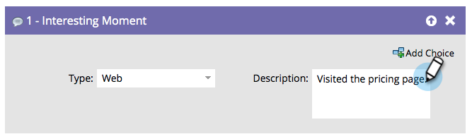

# Momento interesante {#interesting-moment}

Si tiene Marketo Sales Insight, puede usar el paso de flujo **Momento interesante** para dar a su equipo de ventas visibilidad de las cosas interesantes que su gente está haciendo.

1. Seleccione el momento interesante **[!UICONTROL type]** que desee usar.

   

1. Crea una **[!UICONTROL descripción]** que explique el momento interesante a tu equipo de ventas.

   

   >[!TIP]
   >
   >_Menos es más_. Trabaje con su equipo de ventas para asegurarse de que los momentos interesantes sean realmente interesantes.

También puede usar [tokens en momentos interesantes](/help/marketo/product-docs/marketo-sales-insight/msi-for-salesforce/features/tabs-in-the-msi-panel/interesting-moments/trigger-tokens-for-interesting-moments.md){target="_blank"} para crear descripciones dinámicas muy útiles.

>[!MORELIKETHIS]
>
>* [Usando momentos interesantes](/help/marketo/product-docs/marketo-sales-insight/msi-for-salesforce/features/tabs-in-the-msi-panel/interesting-moments/using-interesting-moments.md){target="_blank"}
>* [Tokens para momentos interesantes](/help/marketo/product-docs/marketo-sales-insight/msi-for-salesforce/features/tabs-in-the-msi-panel/interesting-moments/trigger-tokens-for-interesting-moments.md){target="_blank"}
