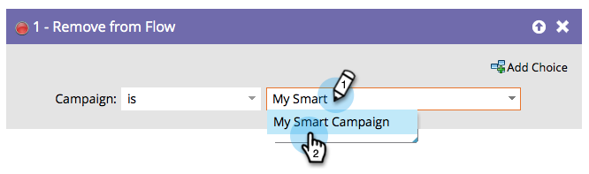

# Quitar del flujo {#remove-from-flow}

Imagine que tiene un flujo de campaña inteligente que utiliza &quot;Enviar alerta&quot; para recordar a un representante de ventas que debe llamar a un posible cliente potencial. Envía un mensaje todos los días hasta que el representante realiza la llamada. Puede utilizar &quot;Eliminar del flujo&quot; en una campaña de déclencheur una vez que se haya contactado con el cliente potencial para detener más alertas. Es como un asiento eyector de la campaña inteligente para una persona.

>[!NOTE]
>
>Esto normalmente afectaría a las personas que están sentadas en el paso de espera de un flujo de campaña.

1. Busque y seleccione la campaña inteligente de la que desee eliminar personas.

   

>[!NOTE]
>
>Puede elegir una campaña inteligente específica o elegir &quot;esta campaña&quot; en la lista desplegable **[!UICONTROL Campaign]** para seleccionar la campaña en la que se encuentra físicamente en ese momento.

>[!NOTE]
>
>Esta funcionalidad está pensada para utilizarse dentro de los pasos de flujo de una campaña inteligente.
