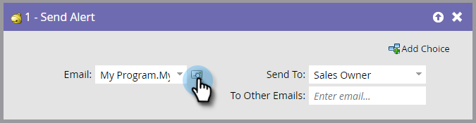

# Enviar alerta {#send-alert}

## Resumen {#overview}

Marketo puede enviar una alerta por correo electrónico con información de la persona a cualquier persona: el propietario de la venta, un socio u otra persona. Utilice la variable **Enviar alerta** paso de flujo.

## Uso {#usage}

1. Busque y seleccione el correo electrónico que desea enviar.

   

   >[!NOTE]
   >
   >La alerta de correo electrónico debe contener toda la información del encabezado y estar en la **Aprobado** estado.

1. Puede hacer clic en el icono de vista previa para asegurarse de que ha seleccionado el correo electrónico correcto.

   

   >[!NOTE]
   >
   >Asegúrese de utilizar la variable **Enviar información de alerta** en su correo electrónico.

1. Seleccione el destinatario de la alerta. Puede elegir Propietario de ventas o Propietario de cuenta.

   

1. De forma opcional, puede agregar cualquier otra dirección de correo electrónico que desee (separada con una coma o un punto y coma).

   

   >[!TIP]
   >
   >En las campañas de déclencheur, puede usar tokens en **A otros correos electrónicos** como `{{lead.Territory Owner}}` o `{{my.Alert Recipient}}` siempre que los valores sean direcciones de correo electrónico válidas. Tokens en **A otros correos electrónicos** no funcionará en una campaña por lotes.

¡Eso es todo! Ahora sabe cómo usar la variable **Enviar alerta** paso de flujo.

>[!MORELIKETHIS]
>
>[Crear un correo electrónico](/help/marketo/product-docs/email-marketing/general/creating-an-email/create-an-email.md)
