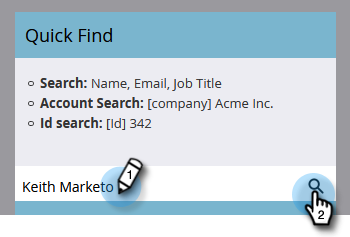

# Acciones de flujo único desde la página de detalles de persona {#single-flow-actions-from-person-detail-page}

Además de ejecutar acciones de flujo únicas desde una Smart List, también puede ejecutarlas directamente en una página de detalles de persona.

1. Haga clic en la **[!UICONTROL base de datos]**.

   

1. Busque la persona que desee.

   

1. Haga clic en el menú desplegable **[!UICONTROL Acciones de persona]** y seleccione el paso de flujo que desee. En este ejemplo usaremos [Enviar correo electrónico](/help/marketo/product-docs/core-marketo-concepts/smart-campaigns/flow-actions/send-email.md){target="_blank"}.

   

1. Seleccione el correo electrónico que desee y haga clic en **[!UICONTROL Ejecutar ahora]**.

   

>[!NOTE]
>
>Si la instancia contiene espacios de trabajo o particiones y se desplaza a una página de detalles de persona directamente (por ejemplo, mediante un vínculo) en lugar de proceder de una página o recurso vinculado a una Workspace, también deberá elegir una Workspace en el paso 4.
