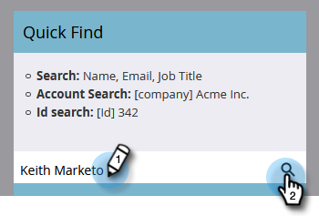

# Acciones de flujo único desde la página de detalles de la persona {#single-flow-actions-from-person-detail-page}

Además de ejecutar acciones de flujo único desde una lista inteligente, también puede ejecutarlas directamente en una página de detalles de persona.

1. Haga clic en **Base de datos**.

   

1. Busque la persona que desee.

   

1. Haga clic en el **Acciones de persona** y seleccione el paso de flujo que desee. En este ejemplo utilizaremos [Enviar correo electrónico](/help/marketo/product-docs/core-marketo-concepts/smart-campaigns/flow-actions/send-email.md).

   

1. Seleccione el correo electrónico deseado y haga clic en **Ejecutar ahora**.

   

>[!NOTE]
>
>Si la instancia contiene espacios de trabajo/particiones y se desplaza a una página de detalles de persona directamente (es decir, a través de un vínculo) en lugar de proceder de una página/recurso vinculado a un espacio de trabajo, también deberá elegir un espacio de trabajo en el paso 4.
