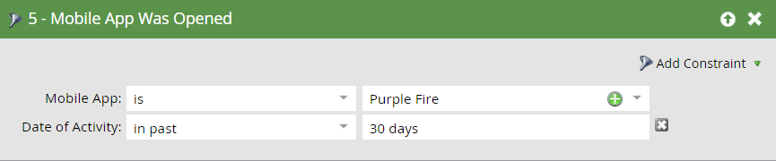

# Activadores y Filtros para Campañas inteligentes móviles {#triggers-and-filters-for-mobile-smart-campaigns}

Puede configurar activadores y filtros para una campaña inteligente de aplicación móvil.

Para la mayoría de las actividades, hay un activador, un filtro y un filtro de inactividad. Use filtros de inactividad para rastrear una acción, como tocar una notificación push, que *no se produjo* .

* Se instaló o se instaló la aplicación móvil
* Se abrió o se abrió la aplicación móvil
* Tiene o tiene Actividad de aplicación móvil
* Tiene o ha tenido una sesión de aplicación móvil
* Toque/toque notificación push móvil

Solo hay filtros para esta actividad:

* Notificación push de envío: filtro y filtro de inactividad

Busque la aplicación **** móvil en el panel derecho para realizar la lista de todos los activadores y filtros de la aplicación móvil.

## Restricciones {#constraints}

Utilice restricciones con activadores y filtros para ordenar los datos con mayor profundidad.

Todos los activadores y filtros, excepto la notificación push de envío, contienen estas dos restricciones estándar:

* Tipo de dispositivo: iPod, iPhone, iPhone 6 Plus, iPad mini, iPad, smartphone Android, tablet Android, Desconocido (se trata de una lista preestablecida)

* Plataforma: iPhone o Android

Algunos activadores y filtros oferta restricciones adicionales, como:

* Versión de la aplicación: una forma de destinatario para personas que no están en la versión más reciente. Por ejemplo, si la última versión de la aplicación es 2.0, puede utilizarla para buscar personas que NO estén en la versión 2.0 de la aplicación

* Instalar origen: actualmente, la única opción es API

* Configuración regional: la configuración del dispositivo

* Aplicación móvil: el nombre de una aplicación específica. Útil para especificar si tiene más de uno

* Versión de la plataforma: la versión del sistema operativo

* Duración de la sesión (segundos): tiempo de sesión cuando la aplicación está en primer plano

* Es push habilitado: **True** significa que se pueden enviar notificaciones push. **Falso** significa que no pueden; por ejemplo, es posible que la persona haya exclusión de recibir notificaciones push

## Activadores y Filtros {#triggers-and-filters}

**Tiene una aplicación móvil**

Utilice este filtro para averiguar qué personas han tenido la aplicación instalada alguna vez. Esto solo está disponible como filtro.

>[!NOTE]
>
>El filtro buscará tanto las instalaciones actuales como las anteriores, ya que Marketing no realiza el seguimiento de las desinstalaciones de la aplicación.

**Restricciones**: Tipo de dispositivo, Plataforma, Aplicación móvil, Versión de la aplicación móvil, Tipo de dispositivo, Origen de instalación, Está habilitado para inserción y Configuración regional

>[!TIP]
>
>Se recomienda especificar Has Mobile App = true y Is Push Enabled = true, así como el nombre de la aplicación móvil al definir la lista inteligente de quién debe recibir una notificación push.

Se instaló o se instaló la aplicación móvil

* Aplicación móvil instalada: activador

* Aplicación móvil instalada: filtro

* NO se instaló la aplicación móvil: filtro de inactividad

**Restricciones**: Tipo de dispositivo, Plataforma, Versión de la aplicación, Configuración regional e Instalar origen

Se abrió o se abrió la aplicación móvil

* Aplicación móvil abierta: activador

* Aplicación móvil abierta: filtro

* NO se abrió la aplicación móvil: filtro de inactividad

**Restricciones**: Tipo y plataforma de dispositivo

Tiene o tiene Actividad de aplicación móvil

Esto proporciona una manera eficaz de rastrear la actividad móvil personalizada. Tendrá que trabajar con su desarrollador para configurar el seguimiento [para Android](http://developers.marketo.com/documentation/mobile/installation-instructions-on-android) y [para iOS](http://developers.marketo.com/documentation/mobile/installation-instructions-on-ios).

* Tiene Actividad de aplicación móvil: activador

* Con Actividad de aplicación móvil: filtro

* NO tenía Actividad de aplicación móvil: filtro de inactividad

**Restricciones**: Tipo y plataforma de dispositivo, más cinco adicionales:

* Acción: actividad móvil personalizada

* Tipo de acción: campo de texto (opcional) utilizado para categorizar varias acciones

* Detalles de la acción: campo de texto (opcional) que proporciona información adicional sobre una acción

* Métrica de acción: campo numérico (opcional) que proporciona información adicional sobre una acción (por ejemplo, precio)

* Duración de la acción (segundos): campo numérico (opcional) que se puede utilizar para capturar cuánto tiempo tardó un usuario en completar una acción

Las restricciones de acción permiten utilizar el activador y los filtros para realizar un seguimiento muy atento de la actividad móvil.

>[!NOTE]
>
>**Ejemplo**
>
>En el tipo de acción *Compras*, hay una acción muy específica, con las otras restricciones que la definen:
>
>* Compró una camisa
>  * Era rojo
>  * Costó 30 dólares
>  * Se tardaron 20 segundos en comprar

Este es el aspecto del filtro en MarketingTo:   

>[!NOTE]
>
>**Ejemplo**
>
>Puede tener varias acciones en el mismo tipo de acción. De hecho, su experiencia de compra normal puede involucrar varias columnas en Compras! ¿Qué tal unos calcetines para ir con eso?
>
>| Tipo de acción | Compras | Compras |
>|---|---|---|
>| Acción | Camisa comprada | Pantalones comprados |
>| Detalles de la acción | Color | Color |
>| Métrica de acción | Precio | Precio |

**Tiene o ha tenido una sesión de aplicación móvil**

* Tiene sesión de aplicación móvil: activador

* Tenía sesión de aplicación móvil: filtro

* NO tuvo sesión de aplicación móvil: filtro de inactividad

**Restricciones**: Tipo de dispositivo, Plataforma y Duración de la sesión (segundos)

Tapas/notificaciones push de toque

* Tocar notificación push - activar

* Notificación push de toque: filtro

* Notificación push NO capturada: filtro de inactividad

**Restricciones**: Tipo de dispositivo, Plataforma, Versión de aplicación móvil, Notificación push y Versión de plataforma

>[!TIP]
>
>Utilice el filtro de inactividad Notificación push no capturada para buscar personas que no tocaron una notificación push recientemente enviada a ellas, de modo que pueda realizar un seguimiento por correo electrónico.

**Notificación** push de envío Esta actividad solo está disponible como filtro.

* Se envió notificación push - filtro

* NO se envió la notificación push - filtro de inactividad

**Restricciones**: Notificación push y aplicación móvil

>[!MORELIKETHIS]
>
>* [Añadir una restricción a un filtro de Lista inteligente](../../../../product-docs/core-marketo-concepts/smart-lists-and-static-lists/using-smart-lists/add-a-constraint-to-a-smart-list-filter.md)
>* [Usar Filtros de inactividad en una Lista inteligente](../../../../product-docs/core-marketo-concepts/smart-lists-and-static-lists/using-smart-lists/use-inactivity-filters-in-a-smart-list.md)

