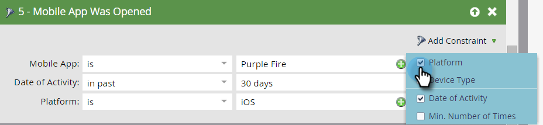

# Déclencheur y filtros para campañas inteligentes móviles {#triggers-and-filters-for-mobile-smart-campaigns}

Puede configurar déclencheur y filtros para una campaña inteligente para aplicaciones móviles.

Para la mayoría de las actividades, hay un déclencheur, un filtro y un filtro de inactividad. Utilice filtros de inactividad para realizar el seguimiento de una acción, como pulsar una notificación push, que *no* ocurre.

* La aplicación móvil está instalada o se instaló
* Se abrió o abrió la aplicación móvil
* Tiene o ha tenido una actividad de aplicación móvil
* Tiene o ha tenido una sesión de aplicación móvil
* Toque/Toque la notificación push móvil

Solo hay filtros para esta actividad:

* Notificación push de se envió: filtro y filtro de inactividad

Buscar **aplicación móvil** en el panel derecho para ver todos los déclencheur y filtros de la aplicación móvil.

## Restricciones {#constraints}

Utilice restricciones con déclencheur y filtros para clasificar aún más los datos.

Todos los déclencheur y filtros, excepto la notificación push de se envió, contienen las dos restricciones estándar siguientes:

* Tipo de dispositivo: iPod, iPhone, iPhone 6 Plus, iPad mini, iPad, smartphone Android, Android Tablet, Desconocido (se trata de una lista preestablecida)

* Plataforma: iPhone o Android

Algunos déclencheur y filtros ofrecen restricciones adicionales, como:

* Versión de la aplicación : una forma de dirigirse a las personas que no están en la versión más reciente. Por ejemplo, si la última versión de la aplicación es 2.0, puede utilizarla para buscar personas que NO estén en la versión 2.0 de la aplicación

* Instalar fuente: Actualmente, la única opción es API

* Configuración regional: la configuración del dispositivo

* Aplicación móvil: El nombre de una aplicación específica. Útil para especificar si tiene más de uno

* Versión de plataforma: la versión del sistema operativo

* Duración de la sesión (segundos): Tiempo de sesión cuando la aplicación está en primer plano

* Está habilitado para push - **True** significa que se pueden enviar notificaciones push. **False** significa que no pueden; por ejemplo, la persona puede haber optado por no recibir notificaciones push

## Déclencheur y filtros {#triggers-and-filters}

**Tiene aplicación móvil**

Utilice este filtro para averiguar todas las personas que alguna vez han instalado su aplicación. Esto solo está disponible como filtro.

>[!NOTE]
>
>El filtro buscará tanto instalaciones actuales como anteriores, ya que Marketo no realiza el seguimiento de las desinstalaciones de aplicaciones.

**Restricciones**: Tipo de dispositivo, Plataforma, Aplicación móvil, Versión de aplicación móvil, Tipo de dispositivo, Origen de instalación, Está habilitado para push y Configuración regional

>[!TIP]
>
>Se recomienda especificar Has Mobile App = true y Is Push Enabled = true, así como el nombre de la aplicación móvil al definir la lista inteligente de quién debe recibir una notificación push.

La aplicación móvil está instalada o se instaló

* La aplicación móvil está instalada: déclencheur

* Aplicación móvil instalada: filtro

* NO se instaló la aplicación móvil: filtro de inactividad

**Restricciones**: Tipo de dispositivo, plataforma, versión de la aplicación, configuración regional e instalar origen

Se abrió o abrió la aplicación móvil

* Aplicación móvil abierta: déclencheur

* Aplicación móvil abierta: filtro

* NO se abrió la aplicación móvil: filtro de inactividad

**Restricciones**: Tipo de dispositivo y plataforma

Tiene o ha tenido una actividad de aplicación móvil

Proporcionan una manera eficaz de rastrear la actividad móvil personalizada. Tendrá que trabajar con su desarrollador para configurar el seguimiento [para Android](https://developers.marketo.com/documentation/mobile/installation-instructions-on-android) y [para iOS](https://developers.marketo.com/documentation/mobile/installation-instructions-on-ios).

* Tiene actividad de aplicación móvil: déclencheur

* Tenia actividad de aplicación móvil: filtro

* NO tenía actividad de aplicación móvil: filtro de inactividad

**Restricciones**: Tipo de dispositivo y plataforma, además de cinco adicionales:

* Acción - Actividad móvil personalizada

* Tipo de acción : (opcional) campo de texto utilizado para categorizar varias acciones.

* Detalles de la acción : campo de texto (opcional) que proporciona información adicional sobre una acción

* Métrica de acción : campo numérico (opcional) que proporciona información adicional sobre una acción (por ejemplo, el precio)

* Longitud de la acción (segundos) : (opcional) campo numérico que se puede utilizar para capturar cuánto tiempo tardó un usuario en completar una acción

Las restricciones de acción permiten utilizar el déclencheur y los filtros para rastrear la actividad móvil muy de cerca.

>[!NOTE]
>
>**Ejemplo**
>
>En el tipo de acción de *Compra*, aquí hay una acción muy específica, con las otras restricciones que la definen:
>
>* Compró una camisa
   >   * Era rojo
   >   * Costó 30 dólares
   >   * Se tardaron 20 segundos en comprar

Este es el aspecto del filtro en Marketo:

>[!NOTE]
>
>**Ejemplo**
>
>Puede tener varias acciones bajo el mismo tipo de acción. De hecho, su experiencia de compra normal puede incluir varias columnas en Compra! ¿Qué tal unos calcetines para ir con eso?
>
>| Tipo de acción | Compra | Compra |
>|---|---|---|
>| Acción | Camiseta comprada | Pantalones comprados |
>| Detalles de la acción | Color | Color |
>| Métrica de la acción | Precio | Precio |

**Tiene o ha tenido una sesión de aplicación móvil**

* Tiene sesión de aplicación móvil: déclencheur

* Tenía sesión de aplicación móvil: filtro

* NO tenía sesión de aplicación móvil: filtro de inactividad

**Restricciones**: Tipo de dispositivo, plataforma y duración de la sesión (segundos)

Toque/Toque la notificación push

* Toque Notificaciones push: déclencheur

* Notificaciones push asignadas: filtro

* Notificación push NO reventada: filtro de inactividad

**Restricciones**: Tipo de dispositivo, plataforma, versión de aplicación móvil, notificación push y versión de plataforma

>[!TIP]
>
>Utilice el filtro de inactividad de notificación push no capturada para encontrar personas que no hayan tocado una notificación push recientemente enviada a ellas, de modo que pueda realizar el seguimiento por correo electrónico.

**Se envió notificación push** Esta actividad solo está disponible como filtro.

* Notificación push de se envió: filtro

* NO se envió notificación push: filtro de inactividad

**Restricciones**: Notificaciones push y aplicación móvil

>[!MORELIKETHIS]
>
>* [Agregar una restricción a un filtro de lista inteligente](/help/marketo/product-docs/core-marketo-concepts/smart-lists-and-static-lists/using-smart-lists/add-a-constraint-to-a-smart-list-filter.md)
>* [Usar filtros de inactividad en una lista inteligente](/help/marketo/product-docs/core-marketo-concepts/smart-lists-and-static-lists/using-smart-lists/use-inactivity-filters-in-a-smart-list.md)

