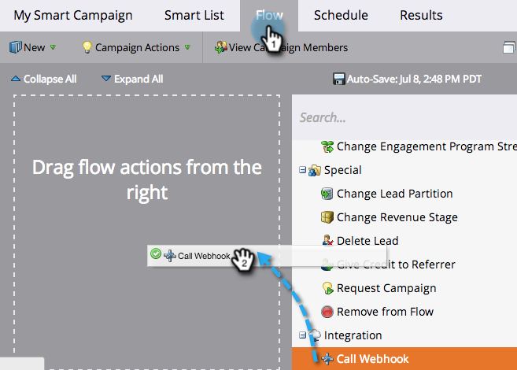

# Uso de un webhook en una campaña inteligente {#use-a-webhook-in-a-smart-campaign}

Para usar un [gancho web](https://experienceleague.adobe.com/en/docs/marketo-developer/marketo/webhooks/webhooks){target="_blank"}, agréguelo a [Smart Campaign](/help/marketo/product-docs/core-marketo-concepts/smart-campaigns/flow-actions/add-a-flow-step-to-a-smart-campaign.md){target="_blank"} como una acción de flujo.

>[!AVAILABILITY]
>
>No todos los usuarios de Marketo Engage han adquirido esta funcionalidad. Póngase en contacto con el equipo de cuenta de Adobe (su administrador de cuentas) para obtener más información.

1. [Crear una campaña inteligente](/help/marketo/product-docs/core-marketo-concepts/smart-campaigns/creating-a-smart-campaign/create-a-new-smart-campaign.md){target="_blank"}.

   >[!NOTE]
   >
   >Los webhooks solo se pueden usar en campañas de Déclencheur.

1. Vaya a la pestaña **[!UICONTROL Flujo]** y arrastre la acción de flujo **[!UICONTROL Llamar al webhook]**.

   

1. Seleccione el **[!UICONTROL webhook]**.

   

1. También puede utilizar Webhooks en una lista inteligente.

   

1. Por último, puede usar Webhooks en **[!UICONTROL Agregar opción]** en un paso de flujo.

   
