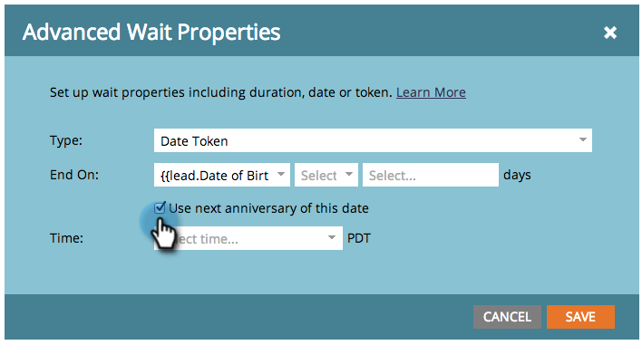

# Uso de un token de fecha en un paso de flujo de espera {#use-a-date-token-in-a-wait-flow-step}

Puede utilizar el paso Flujo de espera para pausar el recorrido de una persona a través de una campaña inteligente hasta una fecha concreta que utilice un token de fecha. También puede modificar la fecha de finalización en un número determinado de días.

>[!NOTE]
>
>Esto solo se aplica a las campañas de Déclencheur. No puede utilizar esta función en campañas por lotes.

1. En la pestaña **[!UICONTROL Flujo]** de tu campaña inteligente, arrastra el cursor sobre el paso de flujo **[!UICONTROL Esperar]**.

   

1. Haga clic en el icono de engranaje.

   

1. En el menú desplegable **[!UICONTROL Tipo]**, seleccione **[!UICONTROL Token de fecha]**.

   

1. Elija un [!UICONTROL Token de fecha] para especificar cuándo debe finalizar el paso de espera:

   * `{{my._____}}`
   * `{{lead.______}}`
   * `{{company.______}}`
   * `{{system._______}}`

   

1. Para esperar hasta el siguiente aniversario de la fecha del año natural actual o siguiente, marque la casilla.

   

   >[!TIP]
   >
   >Utilice esta opción en tokens de fecha que hagan referencia a fechas del pasado, como un cumpleaños o una fecha de inicio del contrato.

1. De forma opcional, puede modificar la fecha de finalización un número determinado de días.

   

   >[!NOTE]
   >
   >También puede especificar el número de días utilizando un token `{{lead.` o `{{company.` que represente un campo entero o un token `{{my.` de tipo numérico.

1. Haga clic en **[!UICONTROL Guardar]**.

   

   >[!MORELIKETHIS]
   >
   >* [Usar una duración en un paso de flujo de espera](/help/marketo/product-docs/core-marketo-concepts/smart-campaigns/flow-actions/wait/use-a-duration-in-a-wait-flow-step.md){target="_blank"}
   >* [Usar una fecha específica en un paso de flujo de espera](/help/marketo/product-docs/core-marketo-concepts/smart-campaigns/flow-actions/wait/use-a-specific-date-in-a-wait-flow-step.md){target="_blank"}
