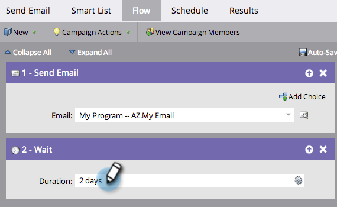

# Utilizar una duración en un paso de flujo de espera {#use-a-duration-in-a-wait-flow-step}

Puede utilizar el paso Flujo de espera para pausar el recorrido de una persona a través de una campaña inteligente durante un tiempo determinado. También puede especificar criterios para el día de la semana y la hora en que termina.

1. En la pestaña **[!UICONTROL Flujo]** de tu campaña inteligente, arrastra el cursor sobre el paso de flujo **[!UICONTROL Esperar]**.

   

1. Escriba el tiempo que desea pausar.

   

1. ¡Ya está! El flujo se pausará durante la duración especificada. Para obtener opciones avanzadas, haga clic en el icono de engranaje a la derecha.

   

1. Especifique el día de la semana en el que debe finalizar el paso de espera.

   

1. Si lo desea, especifique la hora. Haga clic en **[!UICONTROL Guardar]**.

   

   >[!NOTE]
   >
   >**Ejemplo**
   >
   >Una persona déclencheur una campaña inteligente el viernes a las 5 p. m. El paso de espera es avanzado: 48 horas y debe finalizar el lunes a viernes a las 9 a. m.
   >
   >El resultado sería que la persona continuaría en el flujo el **lunes a las 9 a. m.**. Esta es la primera cita M-F después de 48 horas.

   >[!NOTE]
   >
   >La duración, las fechas, las horas y los días utilizados dependen del huso horario de la suscripción.

   >[!MORELIKETHIS]
   >
   >* [Usar una fecha específica en un paso de flujo de espera](/help/marketo/product-docs/core-marketo-concepts/smart-campaigns/flow-actions/wait/use-a-specific-date-in-a-wait-flow-step.md){target="_blank"}
   >* [Usar un token de fecha en un paso de flujo de espera](/help/marketo/product-docs/core-marketo-concepts/smart-campaigns/flow-actions/wait/use-a-date-token-in-a-wait-flow-step.md){target="_blank"}
