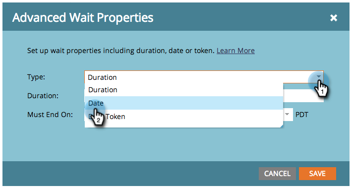

# Usar una fecha específica en un paso de flujo de espera {#use-a-specific-date-in-a-wait-flow-step}

Puede utilizar el paso de flujo **Wait** para pausar el recorrido de una persona a través de una campaña inteligente hasta una fecha determinada.

1. En la pestaña **Flow** de la campaña inteligente, arrastre el paso de flujo **Wait**.

   

1. Haga clic en el icono del engranaje a la derecha.

   

1. En la lista desplegable **Type**, seleccione **Date**.

   

1. Seleccione la fecha específica en la que desea reanudar.

   

1. Especifique la hora (opcional) y haga clic en **Guardar**.

   

>[!MORELIKETHIS]
>
>* [Usar una duración en un paso de flujo de espera](/help/marketo/product-docs/core-marketo-concepts/smart-campaigns/flow-actions/wait/use-a-duration-in-a-wait-flow-step.md)
>* [Uso de un token de fecha en un paso de flujo de espera](/help/marketo/product-docs/core-marketo-concepts/smart-campaigns/flow-actions/wait/use-a-date-token-in-a-wait-flow-step.md)

